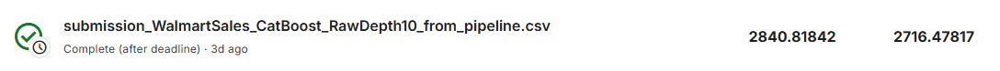
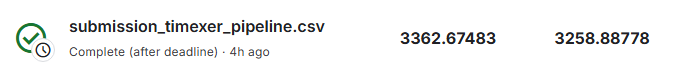
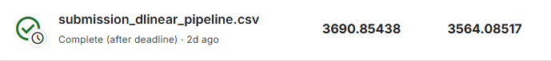

# Walmart Recruiting - Store Sales Forecasting

ეს არის Walmart-ის weekly sales forecasting პროექტი. პროექტში შევადარეთ ოთხი განსხვავებული არქიტექტურა და თითოეული ექსპერიმენტი ცალკე დოკუმენტაციაშია აღწერილი.

## მოდელების README-ები

- [CatBoost](readmes/CatBoost_README.md)
- [DLinear](readmes/DLinear_README.md)
- [Prophet](readmes/Prophet_README.md)
- [TimeXer](readmes/TimeXer_README.md)
  

## ექსპერიმენტები

- [Model experiments და inference notebooks](experiments/)
- [საერთო feature engineering და metric კოდი](src/)
- [გრაფიკები და Kaggle score screenshots](docs/images/)

ყველა მოდელის დეტალური cleaning, feature engineering, validation, tuning, MLflow და inference აღწერილია შესაბამის README-ში.

## Kaggle submission screenshots

### CatBoost

### Prophet

### TimeXer

### DLinear

### LightGBM

### N_BEATS

### TiDE

