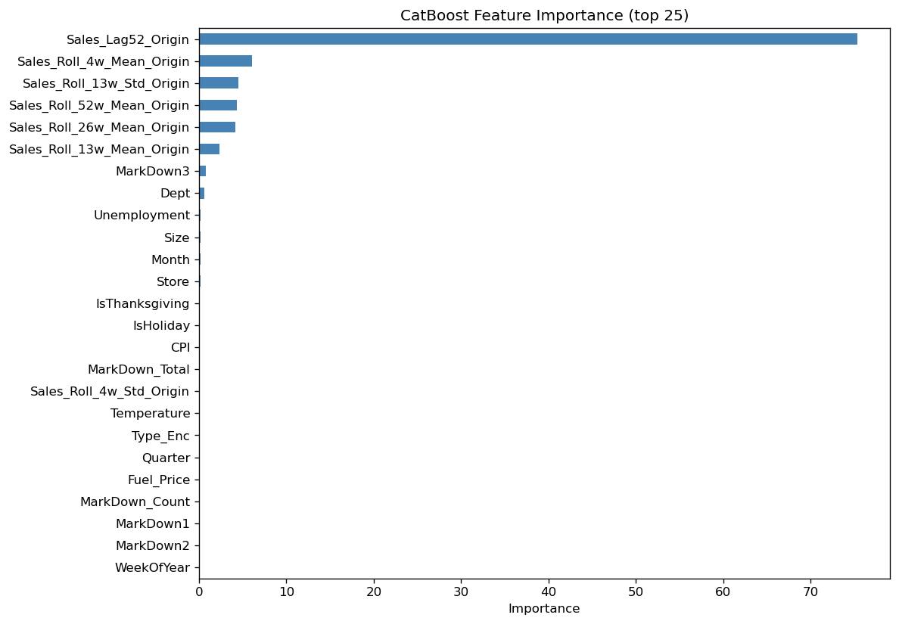
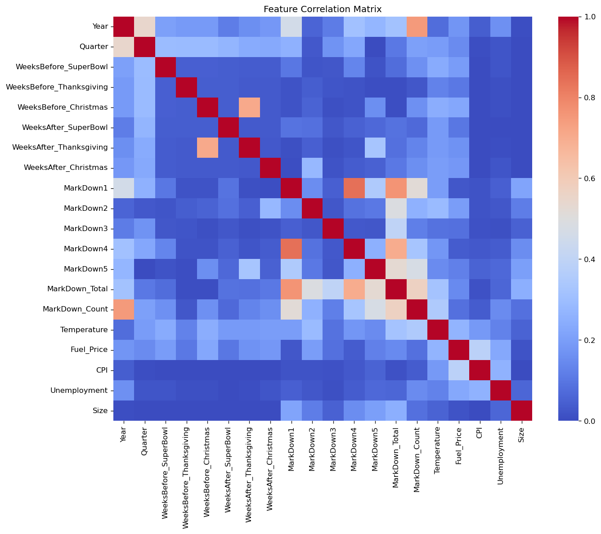
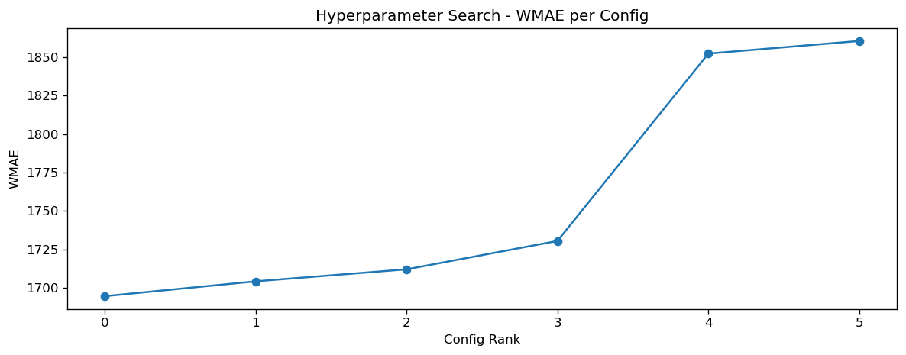

# Walmart Recruiting - Store Sales Forecasting

## კონკურსის მიმოხილვა

Kaggle Walmart Recruiting - Store Sales Forecasting კონკურსის მიზანია Walmart-ის მაღაზიებისა და დეპარტამენტების ყოველკვირეული გაყიდვების პროგნოზირება. 

მოდელმა უნდა იწინასწარმეტყველოს მომავალი 39 კვირის `Weekly_Sales` მნიშვნელობები. პროგნოზირებისათვის ხელმისაწვდომია როგორც ისტორიული გაყიდვები, ასევე დამატებითი ინფორმაცია მაღაზიების ტიპის, ზომის, ეკონომიკური მაჩვენებლებისა და Markdown ფასდაკლებების შესახებ.

მოდელების შეფასება ხდება Weighted Mean Absolute Error-ით (WMAE). ჩვეულებრივ კვირებს ენიჭება წონა 1, ხოლო სადღესასწაულო კვირებს, მაგალითად Thanksgiving-სა და Christmas-ს, ენიჭება წონა 5.

მოდელი განსაკუთრებით კარგად უნდა პროგნოზირებდეს სეზონურ და სადღესასწაულო პერიოდებს. მხოლოდ საშუალო გაყიდვების ზუსტად პროგნოზირება საკმარისი არ არის, რადგან holiday weeks-ის შეცდომა საბოლოო score-ზე ხუთჯერ უფრო ძლიერ მოქმედებს.

პროექტში ერთმანეთს ვადარებთ რამდენიმე განსხვავებული არქიტექტურის მოდელს. თითოეული მოდელისთვის ვამოწმებთ feature engineering-ის მიდგომას, time-series validation-ს, hyperparameter tuning-სა და საბოლოო Kaggle შედეგს.


## რეპოზიტორიის სტრუქტურა

```text
.
|-- src/
|   |-- features.py
|   |-- cv_split.py
|   `-- wmae.py
|-- experiments/
|   |-- model_experiment_CatBoost.ipynb
|   |-- model_experiment_DLinear.ipynb
|   |-- model_experiment_Prophet.ipynb
|   |-- model_experiment_TimeXer.ipynb
|   `-- model_inference.ipynb
|-- readmes/
|   |-- CatBoost_README.md
|   |-- DLinear_README.md
|   |-- Prophet_README.md
|   `-- TimeXer_README.md
`-- README.md
```

`src/features.py` შეიცავს საერთო cleaning და feature engineering ლოგიკას, `src/cv_split.py` - time-based split-ებს, ხოლო `src/wmae.py` - კონკურსის ოფიციალურ მეტრიკას.

`src/features.py` გამოვიყენეთ მონაცემების გასაწმენდად, train/test მონაცემების გასაერთიანებლად და საერთო feature engineering-ის შესასრულებლად. აქ დავამატეთ კალენდარული, სადღესასწაულო, Markdown, მაღაზიისა და გაყიდვების ისტორიულ მონაცემებზე დაფუძნებული ნიშნები. განსაკუთრებით მნიშვნელოვანია origin-style features, რომლებიც გვიცავს data leakage-ისგან და უზრუნველყოფს, რომ validation და test ერთნაირი ლოგიკით დამუშავდეს.

`src/cv_split.py` გამოვიყენეთ time-series მონაცემების ქრონოლოგიურად დასაყოფად. random split-ის ნაცვლად training მონაცემები ყოველთვის წინ უსწრებს validation პერიოდს, რაც რეალურ პროგნოზირების პროცესს შეესაბამება.

`src/wmae.py` გამოვიყენეთ Walmart-ის ოფიციალური შეფასების მეტრიკის დასათვლელად. სადღესასწაულო კვირებს ენიჭება 5-ჯერ მეტი წონა, ამიტომ მოდელების შედარება ხდება როგორც საერთო WMAE-ით, ასევე holiday და non-holiday პერიოდების შეცდომების მიხედვით.


# CatBoost

## რატომ ავირჩიეთ CatBoost

CatBoost არის Decision Trees მოდელი. ის ქმნის ბევრ პატარა გადაწყვეტილების ხეს, სადაც ყოველი შემდეგი ხე წინა ხეების შეცდომების გამოსწორებას ცდილობს. საბოლოო პროგნოზი ყველა ხის შედეგის გაერთიანებით მიიღება.

CatBoost ავირჩიეთ იმიტომ, რომ ჩვენი მონაცემები შერეული ტიპისაა. მასში გვაქვს როგორც რიცხვითი ცვლადები, მაგალითად `Size`, `CPI`, `Temperature` და `Unemployment`, ასევე კატეგორიული ცვლადები, მაგალითად `Store`, `Dept` და `Type`. ამასთან ერთად, მონაცემებში არსებობს კალენდარული, სადღესასწაულო, Markdown და ისტორიულ გაყიდვებზე დაფუძნებული ნიშნები.

CatBoost-ის ერთ-ერთი მთავარი უპირატესობაა კატეგორიული ცვლადების პირდაპირ დამუშავების შესაძლებლობა. ამიტომ `Store`, `Dept` და `Type`-ის გამოყენებისთვის არ დაგვჭირდა მათი დიდი რაოდენობის ხელით შექმნილ dummy სვეტებად გადაკეთება. ეს განსაკუთრებით მნიშვნელოვანია Walmart-ის მონაცემებში, რადგან Store-Department წყვილები ერთმანეთისგან მნიშვნელოვნად განსხვავდება.

## რატომ CatBoost და არა XGBoost

XGBoost-იც ძლიერი გადაწყვეტილების ხეებზე დაფუძნებული მოდელია და tabular მონაცემებზე ხშირად ძალიან კარგ შედეგს იძლევა. თუმცა ჩვენს ამოცანაში CatBoost უფრო მოსახერხებელი იყო შემდეგი მიზეზების გამო:

- CatBoost-ს შეუძლია მომხმარებლის მიერ მითითებული კატეგორიული სვეტების პირდაპირ დამუშავება. ჩვენს შემთხვევაში `Store`, `Dept` და `Type_Enc` მოდელს გადაეცა კატეგორიულ ნიშნებად, ამიტომ მათი one-hot encoding-ად გადაკეთება არ დაგვჭირდა. მიუხედავად იმისა, რომ `Type` თავდაპირველად `Type_Enc`-ად გარდაიქმნა, CatBoost ამ მნიშვნელობებს კატეგორიებად აღიქვამს და არა ერთმანეთზე დალაგებულ რიცხვებად.
- CatBoost-ის ordered boosting და ordered statistics მიდგომები ამცირებს კატეგორიული ცვლადების დამუშავებისა და leakage-ის რისკს;
- CatBoost კარგად ერგება იმ მონაცემებს, სადაც კატეგორიული და რიცხვითი feature-ები ერთად გამოიყენება;
- მოდელში ადვილად შეგვიძლია განვსაზღვროთ რომელი სვეტებია კატეგორიული.

XGBoost-ის გამოყენების შემთხვევაში მოგვიწევდა კატეგორიული ცვლადებითვის უფრო მეტი წვალება ან მათი ტიპების უფრო მკაცრად მომზადება. ორივე მოდელის შედეგი დამოკიდებულია feature engineering-ზე, დროით validation-ზე და leakage-ის სწორად თავიდან აცილებაზე. CatBoost ავირჩიეთ იმიტომ, რომ ის ჩვენს მონაცემთა სტრუქტურას და კატეგორიულ ნიშნებს უფრო ბუნებრივად მოერგო.

ამავდროულად, CatBoost-ის გამოყენება time-series leakage-ის პრობლემას ავტომატურად არ აგვარებს. მოდელს შეუძლია კატეგორიული ცვლადების სწორად დამუშავება, მაგრამ ისტორიული გაყიდვების feature-ები მაინც ისე უნდა შეიქმნას, რომ validation-სა და test-ზე მხოლოდ იმ მომენტამდე არსებული ინფორმაცია იყოს გამოყენებული.

## EDA


EDA-მ გვაჩვენა ოთხი მნიშვნელოვანი კანონზომიერება:

1. `Type A` მაღაზიების საშუალო გაყიდვები მნიშვნელოვნად აღემატება `Type B` და `Type C` მაღაზიებს.
2. დეპარტამენტებს შორის გაყიდვების მასშტაბი მკვეთრად განსხვავდება.
3. MarkDown მონაცემები მხოლოდ 2011 წლის ნოემბრიდან ჩნდება და მანამდე თითქმის მთლიანად missing-ია.
4. წლის ბოლოს, განსაკუთრებით Thanksgiving/Christmas-ის გარშემო, total sales მკვეთრად იზრდება.


Week-of-year გრაფიკზე ყველაზე ძლიერი ზრდა 47-ე და 51-ე კვირების გარშემო ჩანს. `Weekly_Sales` მარჯვნივ საკმაოდ არათანაბარია.

### როგორ გამოვიყენეთ EDA

| EDA დაკვირვება | მოდელირების გადაწყვეტილება |
|---|---|
| Store Type-ებს განსხვავებული გაყიდვების დონე აქვთ | `Store`, `Dept` და `Type_Enc` შევიტანეთ კატეგორიულ ნიშნებად |
| კვირის ნომერი და წლის ბოლო | დავამატეთ `WeekOfYear`, `Month`, `Quarter`, holiday proximity და `Sales_Lag52_Origin` |
| Holiday შეცდომა 5-ჯერ ძვირია | training loss-ად MAE, selection metric-ად ზუსტად WMAE გამოვიყენეთ |
| MarkDown-ების 64-74% missing-ია და მათი ისტორია გვიან იწყება | missing მნიშვნელობა შევავსეთ 0-ით და შევქმენით `MarkDown_Total` და `MarkDown_Count` |
| Target right-skewed-ია და იშვიათი დიდი spike-ები აქვს | მხოლოდ საშუალო trend-ზე დაყრდნობა არ აღმოჩნდა საკმარისი; შევინარჩუნეთ annual sales anchor |
| უარყოფითი sales რეალურ returns-ს ასახავს | train target არ დაგვიკლიპავს; მხოლოდ submission prediction შევზღუდეთ 0-ზე ქვემოთ |


## მონაცემების გაწმენდა

`CatBoost_Cleaning` ეტაპზე შესრულდა:

- `Date` გარდაიქმნა datetime ფორმატში;
- `Store`-`Dept`-`Date` duplicate row-ები წაიშალა;
- `MarkDown1`-`MarkDown5` missing მნიშვნელობები შეივსო 0-ით და უარყოფითი markdown-ები შეიზღუდა 0-ზე;
- `CPI`, `Unemployment`, `Temperature` და `Fuel_Price` შეივსო მაღაზიის შიგნით forward/backward fill-ით;
- უარყოფითი `Weekly_Sales` მნიშვნელობები train-ში შენარჩუნდა.

## Feature Engineering

Feature-ები ჯგუფებად დავყავით:

| ჯგუფი | მაგალითები |
|---|---|
| Calendar | `Year`, `Month`, `WeekOfYear`, `Quarter` |
| Holiday | `IsThanksgiving`, `IsChristmas`, `WeeksBefore_*`, `WeeksAfter_*` |
| Store/economic | `Store`, `Dept`, `Type_Enc`, `Size`, `CPI`, `Unemployment`, `Fuel_Price` |
| Markdown | `MarkDown1`-`MarkDown5`, `MarkDown_Total`, `MarkDown_Count` |
| Origin sales history | `Forecast_Horizon`, `Sales_Lag52_Origin`, 4/13/26/52-week origin statistics |

### რატომ არ გამოვიყენეთ ჩვეულებრივი short lag-ები საბოლოო მოდელში

პირველ ვერსიაში გვქონდა `Sales_Lag1`, `Sales_Lag2`, `Sales_Lag4`, `Sales_Lag13`, rolling mean-ები და სხვა per-row ისტორიული ნიშნები. Local validation-ზე CatBoost-ის WMAE დაახლოებით **1,488** იყო, მაგრამ Kaggle-ზე score დაახლოებით **25,000-30,000** გახდა.

მიზეზი ის იყო, რომ train და test მონაცემებში feature-ები ერთნაირი წესით არ იქმნებოდა. მაგალითად, 20-ე test კვირის `Lag1` ნიშნავს მე-19-ე test კვირის ნამდვილ გაყიდვას. Kaggle-ის prediction მომენტში ეს მნიშვნელობა არ ვიცით. Local validation-ში კი feature-ების მთლიან frame-ზე აგებისას მოდელი ასეთ ნამდვილ წინა validation sales-ს იღებდა. შედეგად validation რეალურ inference-ზე გაცილებით მარტივი იყო.

### Origin-style feature contract

გამოსწორების შემდეგ training frame შეიქმნა `build_origin_training_frame()`-ით, validation/test კი `add_origin_style_features()`-ით. თითოეული 39-კვირიანი horizon-ის ყველა row მხოლოდ forecast origin-მდე ცნობილ ისტორიას იყენებს.


საბოლოო CatBoost feature set-ში short per-row lag-ები აკრძალულია. მთავარი ისტორიული anchor არის წინა წლის შესაბამისი კვირა, `Sales_Lag52_Origin`, ხოლო rolling statistics forecast origin-ზე ერთხელ ითვლება და horizon-ის განმავლობაში უცვლელია. ამით train, validation და Kaggle test ერთსა და იმავე ინფორმაციულ პირობებში აღმოჩნდა.

## Feature Selection



Feature importance ადასტურებს EDA-ს დასკვნას: `Sales_Lag52_Origin` ყველაზე ძლიერი predictor-ია. შემდეგ მოდის origin-ზე გამოთვლილი rolling საშუალოები და spread/statistical ნიშნები. ეს ნიშნავს, რომ Walmart-ის ამ მონაცემებში annual seasonality უფრო ძლიერია, ვიდრე მხოლოდ ეკონომიკური ან markdown ცვლადები.



## Validation სტრატეგია

Random train/test split არ გამოგვიყენებია. ყველა validation პერიოდი ქრონოლოგიურად training პერიოდის შემდეგ მოდის. ძირითადი შეფასება WMAE-ით მოხდა და ცალკე ვინახავდით holiday და non-holiday MAE-ს.

Validation horizon კონკურსის 39 კვირიან test horizon-ს უნდა ჰგავდეს. მოკლე 13 კვირიანი cutoff tuning-ისთვის სწრაფია, მაგრამ შეიძლება ვერ შეიცავდეს ისეთივე holiday mix-ს, როგორიც Kaggle test-ს აქვს.

## Hyperparameter Tuning



პირველ ეტაპზე ჩავატარეთ სტანდარტული hyperparameter tuning, სადაც კონკრეტულ 13-კვირიან validation პერიოდზე ვცვლიდით `depth`, `learning_rate` და `l2_leaf_reg` პარამეტრებს. ამ ექსპერიმენტში საუკეთესო შედეგი `depth=6`-მა აჩვენა. ეს შედეგი მხოლოდ ამ კონკრეტულ validation cutoff-სა და tuning setup-ს ეხება.

შემდეგ ჩავატარეთ ცალკე focused experiment, რომლის მიზანი იყო origin-style feature-ების მნიშვნელობისა და ხეების სიღრმის გავლენის შემოწმება. ამ ექსპერიმენტში შევადარეთ base features და origin features სხვადასხვა depth-თან ერთად. ამ setup-ში საუკეთესო შედეგი მიიღო `depth=10`-მა origin features-თან ერთად.

ამიტომ პირველი ცხრილის შედეგი არ ეწინააღმდეგება მეორე ცხრილს. `depth=6` იყო საუკეთესო სტანდარტულ tuning ექსპერიმენტში, ხოლო `depth=10` - ცალკე origin-feature ქსპერიმენტში. შედეგების განსხვავება აჩვენებს, რომ მოდელის შეფასება დამოკიდებულია არა მხოლოდ ჰიპერპარამეტრებზე, არამედ validation პერიოდისა და feature engineering-ის სწორად შერჩეულ setup-ზეც.

საბოლოო Kaggle კანდიდატად ავირჩიეთ `depth=10` origin features-თან ერთად, რადგან ამ კომბინაციამ უკეთ დაიჭირა წლიური სეზონურობა და სადღესასწაულო გაყიდვების მკვეთრი ზრდა.

### სტანდარტული hyperparameter tuning

| Depth | Learning rate | L2 | Validation WMAE |
|---:|---:|---:|---:|
| 6 | 0.03 | 3 | 1,694.64 |
| 6 | 0.03 | 5 | 1,704.29 |
| 8 | 0.03 | 5 | 1,712.10 |
| 8 | 0.03 | 3 | 1,730.54 |
| 10 | 0.03 | 5 | 1,852.36 |
| 10 | 0.03 | 3 | 1,860.56 |

ამ კონკრეტულ cutoff-ზე depth 6 საუკეთესო იყო.


### Origin features-ისა და ხეების სიღრმის შედარება

| კონფიგურაცია | Validation WMAE |
|---|---:|
| Depth 5, origin features | 1,722.82 |
| Depth 5, მხოლოდ base features | 3,886.38 |
| Depth 10, origin features | **1,459.06** |
| Depth 10, მხოლოდ base features | 2,552.17 |

ორი დასკვნა მივიღეთ: origin features ორივე depth-ზე აუცილებელია, ხოლო validation შედეგი cutoff-სა და experiment setup-ზე მგრძნობიარეა. საბოლოო depth 10 გამოვიყენეთ, რადგან holiday/spike შეფასებაში უკეთესი იყო.

## მთავარი სირთულეები და გამოსწორებები

### 1. ზედმეტად კარგი local score 

პირველი WMAE, დაახლოებით 1,488, რეალურ კარგ პროგნოზს არ ასახავდა. Validation-ში short lag-ებს ისეთი ინფორმაცია ჰქონდათ, რომელიც 39-კვირიან Kaggle horizon-ზე ხელმისაწვდომი არ იყო.

**გამოსწორება:** training, validation და test მონაცემებისთვის გაყიდვებზე დაფუძნებული feature-ები ერთი და იმავე წესით შევქმენით. თითოეული forecast origin-ისთვის გამოვიყენეთ მხოლოდ იმ თარიღამდე არსებული ისტორია და არ გამოვიყენეთ მომავალი კვირების რეალური გაყიდვები. ამის შედეგად validation-ის პირობები რეალურ Kaggle inference-ს დაემთხვა.

### 2. გამოსწორების შემდეგ training, validation და test მონაცემებისთვის feature-ები ერთი და იმავე წესით შევქმენით, მაგრამ ისევ ცუდი Kaggle score გვქონდა

Leakage-ის მოცილების შემდეგ CatBoost-ის Kaggle score კვლავ დაახლოებით 25,329 იყო. მოდელი საშუალო კვირებს ხვდებოდა, მაგრამ იშვიათ, WMAE-სთვის ძვირ holiday spike-ებს ვეღარ მიყვებოდა.

მაგალითად, `Store 10 / Dept 72` Black Friday კვირისთვის:

| მნიშვნელობა | Weekly Sales |
|---|---:|
| წინა წლის შესაბამისი კვირა, Lag52 | ~630,999 |
| ძველი raw prediction | ~12,844 |
| Depth-10 prediction | ~323,912 |

Seasonal naive baseline-მა, რომელიც იმავე Store-Dept-ის წინა წლის კვირას იმეორებს, დაახლოებით 3,000 Kaggle Score მიიღო. ანუ მივხვდით, რომ კარგი იქნებოდა დიაგნოსტიკისთვის.

**გამოსწორება:** feature-ებში შევინარჩუნეთ წინა წლის შესაბამისი კვირის გაყიდვები, რადგან მონაცემებში წლიური სეზონურობა განსაკუთრებით ძლიერია. ასევე გავზარდეთ გადაწყვეტილების ხეების სიღრმე, რათა მოდელს იშვიათი და მაღალი სადღესასწაულო გაყიდვების უკეთ სწავლა შეძლებოდა. დამატებით, ცალკე შევაფასეთ სადღესასწაულო კვირებზე დაშვებული შეცდომები, რადგან WMAE-ში ამ კვირებს ხუთჯერ მეტი წონა აქვს.

### 3. დაბალი validation WMAE არ უდრის Kaggle score-ს

Local validation და Kaggle სხვადასხვა კალენდარულ მონაკვეთს შეიცავს. თუ cutoff-ში Black Friday/Christmas-ის განაწილება განსხვავებულია, საშუალო WMAE შეიძლება ოპტიმისტური იყოს.

**გამოსწორება:** შევადარეთ seasonal naive, raw CatBoost, residual ვარიანტები. საბოლოო არჩევანი მხოლოდ ერთი tuning table-ით არ გაგვიკეთებია.

## ექსპერიმენტების შედეგები


| ექსპერიმენტი | შედეგი |
|---|---:|
| პირველი raw CatBoost Kaggle submission | ~25,329 |
| Lag52 guardrail | ~22,290 |
| Residual clip 20% | ~4,981 |
| Residual clip 10% | ~3,655 |
| Residual clip 5% | ~3,260 |
| Seasonal naive baseline | ~3,000 |
| CatBoost Depth 10 origin pipeline, public | **2,716.47817** |
| CatBoost Depth 10 origin pipeline, private | **2,840.81842** |

საბოლოო CatBoost-მა seasonal naive-საც აჯობა. ეს მნიშვნელოვანია: მოდელმა annual pattern შეინარჩუნა, მაგრამ დამატებითი calendar, Store/Dept და contextual feature-ებით უბრალო წინა-წლის გამეორებაზე უკეთესი correction ისწავლა.

## MLflow სტრუქტურა

CatBoost-ის ყველა ეტაპი ინახება `CatBoost_Training` experiment-ში:

```text
CatBoost_Training
|-- CatBoost_Cleaning
|-- CatBoost_Feature_Selection
|-- CatBoost_CV
|-- CatBoost_Tuning
|   |-- CatBoost_Trial_01
|   |-- CatBoost_Trial_02
|   `-- ...
`-- CatBoost_Final
```

ლოგებში ინახება:

- cleaning statistics და dataset dimensions;
- selected feature-ები და feature contract;
- fold-level WMAE, holiday MAE და non-holiday MAE;
- ყველა tuning trial-ის პარამეტრები, `best_iteration` და WMAE;
- feature importance, correlation და tuning chart artifacts;
- საბოლოო fitted pipeline.

ექსპერიმენტები ხელმისაწვდომია [DagsHub repository-ში](https://dagshub.com/sansi23/Walmart-Recruiting---Store-Sales-Forecasting).

## საბოლოო Pipeline და Inference

საბოლოო pipeline-ის კონტრაქტია:

```text
Raw merged Walmart dataframe
        -> cleaning and origin-style feature transformer
        -> selected CatBoost feature columns
        -> fitted CatBoostRegressor
        -> predictions restored to original row order
```

Pipeline პირდაპირ raw merged test dataframe-ს იღებს. `model_inference.ipynb` საუკეთესო დარეგისტრირებულ მოდელს MLflow Model Registry-დან ტვირთავს, აკეთებს prediction-ს, ამოწმებს row count/order-ს და `sampleSubmission`-ის `Id`-ზე merge-ით ქმნის submission-ს.

საბოლოო submission ფაილი იყო `submission_WalmartSales_CatBoost_RawDepth10_from_pipeline.csv`. Prediction-ების row order-ის შემოწმება აუცილებელია, რადგან სწორად დათვლილი მნიშვნელობებიც კი არასწორ `Store`-`Dept`-`Date` row-ზე მოხვედრისას Kaggle score-ს მთლიანად აფუჭებს.

## CatBoost-ის მთავარი დასკვნები

1. სწორად დაყოფილი validation-იც შეიძლება არარეალური იყოს, თუ მისი feature-ების გამოთვლისას მომავალ გაყიდვებზე დაყრდნობილი ინფორმაცია გამოიყენება.
2. Train, validation და test ერთი forecast-origin feature contract-ით უნდა შეიქმნას.
3. Walmart-ის მონაცემებში 52-კვირიანი seasonality ყველაზე კარგი მონაცემია.
4. WMAE-ს გამო holiday spike-ები საშუალო კვირებზე გაცილებით მნიშვნელოვანია.
5. Seasonal naive კარგი ბეისლაინია.


