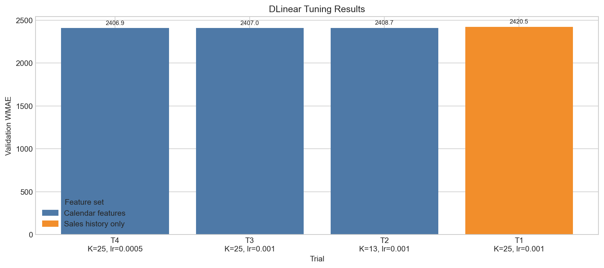
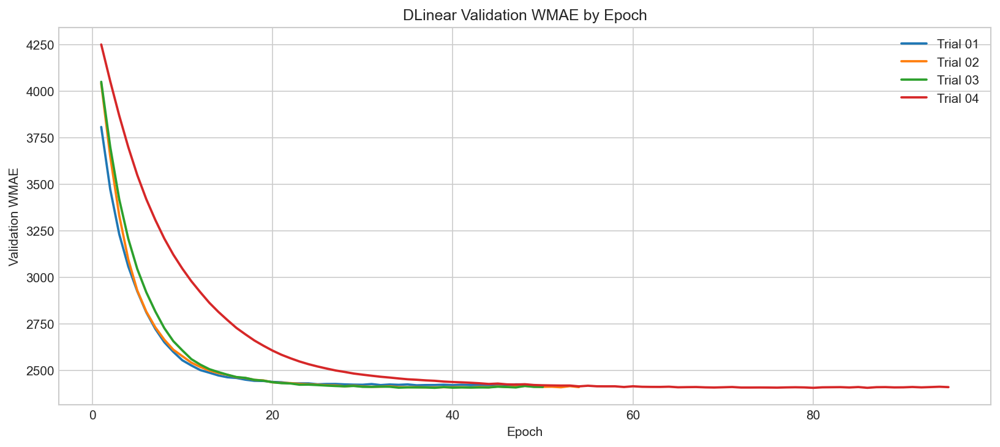

# Walmart Recruiting - Store Sales Forecasting

## კონკურსის მიმოხილვა

Kaggle Walmart Recruiting - Store Sales Forecasting კონკურსის მიზანია Walmart-ის მაღაზიებისა და დეპარტამენტების ყოველკვირეული გაყიდვების პროგნოზირება. 

მოდელმა უნდა იწინასწარმეტყველოს მომავალი 39 კვირის `Weekly_Sales` მნიშვნელობები. პროგნოზირებისათვის ხელმისაწვდომია როგორც ისტორიული გაყიდვები, ასევე დამატებითი ინფორმაცია მაღაზიების ტიპის, ზომის, ეკონომიკური მაჩვენებლებისა და Markdown ფასდაკლებების შესახებ.

მოდელების შეფასება ხდება Weighted Mean Absolute Error-ით (WMAE). ჩვეულებრივ კვირებს ენიჭება წონა 1, ხოლო სადღესასწაულო კვირებს, მაგალითად Thanksgiving-სა და Christmas-ს, ენიჭება წონა 5.

მოდელი განსაკუთრებით კარგად უნდა პროგნოზირებდეს სეზონურ და სადღესასწაულო პერიოდებს. მხოლოდ საშუალო გაყიდვების ზუსტად პროგნოზირება საკმარისი არ არის, რადგან holiday weeks-ის შეცდომა საბოლოო score-ზე ხუთჯერ უფრო ძლიერ მოქმედებს.

პროექტში ერთმანეთს ვადარებთ რამდენიმე განსხვავებული არქიტექტურის მოდელს. თითოეული მოდელისთვის ვამოწმებთ feature engineering-ის მიდგომას, time-series validation-ს, hyperparameter tuning-სა და საბოლოო Kaggle შედეგს.

## რეპოზიტორიის სტრუქტურა

```text
.
|-- src/
|   |-- features.py
|   |-- cv_split.py
|   `-- wmae.py
|-- experiments/
|   |-- model_experiment_CatBoost.ipynb
|   |-- model_experiment_DLinear.ipynb
|   |-- model_experiment_Prophet.ipynb
|   |-- model_experiment_TimeXer.ipynb
|   `-- model_inference.ipynb
|-- readmes/
|   |-- CatBoost_README.md
|   |-- DLinear_README.md
|   |-- Prophet_README.md
|   `-- TimeXer_README.md
`-- README.md
```

`src/features.py` შეიცავს საერთო cleaning და feature engineering ლოგიკას, `src/cv_split.py` - time-based split-ებს, ხოლო `src/wmae.py` - კონკურსის ოფიციალურ მეტრიკას.

`src/features.py` გამოვიყენეთ მონაცემების გასაწმენდად, train/test მონაცემების გასაერთიანებლად და საერთო feature engineering-ის შესასრულებლად. აქ დავამატეთ კალენდარული, სადღესასწაულო, Markdown, მაღაზიისა და გაყიდვების ისტორიულ მონაცემებზე დაფუძნებული ნიშნები. განსაკუთრებით მნიშვნელოვანია origin-style features, რომლებიც გვიცავს data leakage-ისგან და უზრუნველყოფს, რომ validation და test ერთნაირი ლოგიკით დამუშავდეს.

`src/cv_split.py` გამოვიყენეთ time-series მონაცემების ქრონოლოგიურად დასაყოფად. random split-ის ნაცვლად training მონაცემები ყოველთვის წინ უსწრებს validation პერიოდს, რაც რეალურ პროგნოზირების პროცესს შეესაბამება.

`src/wmae.py` გამოვიყენეთ Walmart-ის ოფიციალური შეფასების მეტრიკის დასათვლელად. სადღესასწაულო კვირებს ენიჭება 5-ჯერ მეტი წონა, ამიტომ მოდელების შედარება ხდება როგორც საერთო WMAE-ით, ასევე holiday და non-holiday პერიოდების შეცდომების მიხედვით.

# DLinear

## რატომ ავირჩიეთ DLinear

DLinear არის Deep Learning-ის time-series არქიტექტურა, რომელიც ისტორიულ სერიას ორ ნაწილად ყოფს: გრძელვადიან მიმართულებად და სეზონურ კომპონენტად. შემდეგ ეს ორი კომპონენტი გამოიყენება მომდევნო 39 კვირის გაყიდვების პროგნოზირებისთვის.

DLinear ავირჩიეთ იმის გასარკვევად, რამდენად კარგად შეუძლია მარტივ, მაგრამ სპეციალურად time-series-ისთვის შექმნილ ნეირონულ მოდელს Walmart-ის მონაცემებში არსებული წლიური სეზონურობისა და გაყიდვების ტენდენციის სწავლა. CatBoost-ისგან განსხვავებით, DLinear-ის მთავარი შესატანი ინფორმაცია არის თითოეული Store-Dept სერიის გაყიდვების ისტორია და მომავალი კვირების წინასწარ ცნობილი კალენდარული ნიშნები.

DLinear არ არის Transformer და მასში არ არის რთული attention მექანიზმი. მას შეუძლია პირდაპირ მიიღოს ბოლო 52 კვირის გაყიდვები და ერთდროულად იწინასწარმეტყველოს შემდეგი 39 კვირა. ეს მიდგომა კარგად ერგება ჩვენს კონკურსს.

## EDA

DLinear-ისთვის გამოვიყენეთ იგივე EDA, რაც CatBoost-ისთვის, რადგან მონაცემთა საერთო კანონზომიერებები ორივე მოდელს ეხება.


EDA-მ გვაჩვენა ოთხი მნიშვნელოვანი კანონზომიერება:

1. `Type A` მაღაზიების საშუალო გაყიდვები მნიშვნელოვნად აღემატება `Type B` და `Type C` მაღაზიებს.
2. დეპარტამენტებს შორის გაყიდვების მასშტაბი მკვეთრად განსხვავდება.
3. MarkDown მონაცემები მხოლოდ 2011 წლის ნოემბრიდან ჩნდება და მანამდე თითქმის მთლიანად missing-ია.
4. წლის ბოლოს, განსაკუთრებით Thanksgiving/Christmas-ის გარშემო, total sales მკვეთრად იზრდება.


Week-of-year გრაფიკზე ყველაზე ძლიერი ზრდა 47-ე და 51-ე კვირების გარშემო ჩანს. ეს DLinear-ისთვის მნიშვნელოვანია, რადგან სეზონურობა პირდაპირ ისტორიულ გაყიდვებში უნდა ისწავლოს. ამიტომ გამოვიყენეთ 52-კვირიანი lookback, რათა მოდელს დაახლოებით ერთი სრული წლის ისტორია ჰქონოდა.

### როგორ გამოვიყენეთ EDA

| EDA დაკვირვება | DLinear-ის გადაწყვეტილება |
|---|---|
| Store Type-ებს განსხვავებული გაყიდვების დონე აქვთ | თითოეული `Store`-`Dept` წყვილი ცალკე დროით სერიად დავამუშავეთ და თითოეული სერია საკუთარი საშუალო/სტანდარტული გადახრით დავარეგულირეთ |
| კვირის ნომერი და წლის ბოლო | გამოვიყენეთ `WeekSin`, `WeekCos`, `WeekSin2` და `WeekCos2`, რათა წლიური ციკლი უწყვეტი სახით მიგვეწოდებინა |
| Holiday შეცდომა 5-ჯერ ძვირია | training loss-ში სადღესასწაულო კვირებს მივანიჭეთ 5-ის წონა და selection metric-ად WMAE გამოვიყენეთ |
| MarkDown-ების დიდი ნაწილი missing-ია და მათი ისტორია გვიან იწყება | missing მნიშვნელობები შევავსეთ 0-ით და შევქმენით `MarkDownLog` და `MarkDownCountScaled` |
| Target-ს აქვს მაღალი სეზონური ცვლილებები და spike-ები | მოდელს მივეცით 52 კვირის ისტორია და 39 კვირის ერთდროული forecast horizon |

## მონაცემების გაწმენდა

DLinear-ის preprocessing ეტაპზე შესრულდა:

- `Date` გარდაიქმნა datetime ფორმატში და მონაცემები დალაგდა `Store`, `Dept`, `Date` თანმიმდევრობით;
- უარყოფითი `Weekly_Sales` მნიშვნელობები 0-ზე ქვემოთ შეიზღუდა, რადგან DLinear-ის საბოლოო პროგნოზებში უარყოფითი გაყიდვები არ გვჭირდებოდა;
- `MarkDown1`-`MarkDown5` missing მნიშვნელობები შეივსო 0-ით და უარყოფითი markdown-ები 0-ზე შეიზღუდა;
- `CPI`, `Unemployment`, `Temperature` და `Fuel_Price` შეივსო კონკრეტული მაღაზიის ფარგლებში forward-fill და backward-fill მეთოდებით;
- თითოეული Store-Dept სერიისთვის გამოითვალა საშუალო და სტანდარტული გადახრა, რათა სერიები ერთნაირ მასშტაბზე გადაგვეყვანა.

DLinear-ისთვის ცალკე ნორმალიზაცია აუცილებელია, რადგან ერთი მაღაზიის დიდი დეპარტამენტის გაყიდვები შეიძლება ათობითჯერ აღემატებოდეს სხვა დეპარტამენტის გაყიდვებს. მოდელი სწავლობს ნორმალიზებულ სერიას, ხოლო prediction-ის შემდეგ შედეგი ისევ საწყის მასშტაბზე ბრუნდება.

## Feature Engineering

DLinear-ში CatBoost-ის ყველა feature არ გამოგვიყენებია. DLinear-ის მთავარი input არის გაყიდვების დროითი ფანჯარა, ხოლო დამატებითი ნიშნები მხოლოდ ის future features-ია, რომელთა ცოდნაც მთელი 39-კვირიანი პროგნოზის დროს შეგვიძლია.

| ჯგუფი | გამოყენებული ნიშნები |
|---|---|
| გაყიდვების ისტორია | ბოლო `52` კვირის ნორმალიზებული `Weekly_Sales` |
| წლიური სეზონურობა | `WeekSin`, `WeekCos`, `WeekSin2`, `WeekCos2` |
| დღესასწაულები | `IsHoliday`, `IsSuperBowl`, `IsLaborDay`, `IsThanksgiving`, `IsChristmas` |
| Markdown | `MarkDownLog`, `MarkDownCountScaled` |

`Store` და `Dept` მოდელს პირდაპირ რიცხვით feature-ებად არ გადაეცა. ისინი გამოიყენება იმისათვის, რომ თითოეული სერია ცალკე დამუშავდეს, მისი ისტორია ნორმალიზდეს და შესაბამისი პროგნოზი სწორ Store-Dept წყვილს დაუბრუნდეს.

## DLinear-ის არქიტექტურა

მოდელი თითოეულ training window-ზე იღებს:

```text
ბოლო 52 კვირის გაყიდვები -> შემდეგი 39 კვირის პროგნოზი
```

პირველ ეტაპზე 52-კვირიანი სერია იყოფა ორ კომპონენტად:

- trend - სერიის უფრო მყარი მიმართულება;
- seasonal - trend-ის გამოკლების შემდეგ დარჩენილი მოკლევადიანი ნაწილი.

ჩვენს იმპლემენტაციაში trend და seasonal კომპონენტები ცალ-ცალკე გადის Linear ფენაში, რომელიც 52 შესატან კვირას 39 მომავალ კვირად გარდაქმნის. დამატებითი calendar და Markdown features ცალკე Linear ფენით ემატება საბოლოო პროგნოზს.

ტრენინგისას გამოვიყენეთ:

- AdamW optimizer;
- weighted L1 loss, სადაც holiday rows-ს წონა 5 აქვს;
- gradient clipping, რათა იშვიათმა დიდმა გაყიდვებმა training არასტაბილური არ გახადოს;
- early stopping, რომელიც validation WMAE-ის გაუარესებისას training-ს აჩერებს.

მოდელი GPU-ზე გაეშვა, რადგან DLinear-ის პარალელიზაცია შეუძლია.

## Validation სტრატეგია

DLinear-ის validation-სთვის გამოვიყენეთ ერთი სრული 39-კვირიანი მომავალი პერიოდი:

```text
Training history: 2010-02-05 - 2012-01-27
Validation:       2012-02-03 - 2012-10-26
```

ეს validation პირდაპირ შეესაბამება Kaggle test-ის ხანგრძლივობას. მოდელს validation-ის დასაწყისში მიეწოდება მხოლოდ 2012-01-27-მდე ცნობილი ისტორია და შემდეგ ერთდროულად პროგნოზირებს მომდევნო 39 კვირას.

ეს მიდგომა მნიშვნელოვანია, რადგან DLinear-ს არ შეუძლია validation-ის მეორე კვირისთვის validation-ის პირველი კვირის რეალური გაყიდვების მიღება. ის მთელი horizon-ისთვის იყენებს მხოლოდ origin-მდე არსებულ ბოლო 52 კვირას და მომავალი კვირების ცნობილ კალენდარულ/Markdown ნიშნებს.

შეფასებისას ვითვლიდით საერთო WMAE-ს და ვამოწმებდით, რამდენი row საჭიროებდა fallback პროგნოზს. თუ კონკრეტული Store-Dept სერიისთვის საკმარისი ისტორია ვერ მოიძებნა, გამოიყენებოდა წინა წლის შესაბამისი კვირის გაყიდვები, შემდეგ სერიის საშუალო და ბოლოს საერთო საშუალო.

## Hyperparameter Tuning





შევადარეთ ოთხი configuration. ყველა trial-ში lookback იყო 52 კვირა და forecast horizon - 39 კვირა. იცვლებოდა moving-average kernel-ის ზომა, learning rate და future calendar/Markdown features-ის გამოყენება.

| Trial | Kernel | Learning rate | Future features | საუკეთესო epoch | Validation WMAE |
|---:|---:|---:|---|---:|---:|
| 1 | 25 | 0.001 | არა | 36 | 2,420.51 |
| 2 | 13 | 0.001 | კი | 42 | 2,408.71 |
| 3 | 25 | 0.001 | კი | 38 | 2,406.96 |
| 4 | 25 | 0.0005 | კი | 80 | **2,406.91** |

საუკეთესო configuration იყო `kernel=25`, `learning_rate=0.0005` და future features-ის გამოყენება. Future features-ის დამატებამ sales-only ვარიანტთან შედარებით შედეგი გააუმჯობესა, თუმცა გაუმჯობესება მცირე იყო. ეს მიუთითებს, რომ DLinear-ისთვის მთავარი სიგნალი მაინც გაყიდვების ისტორიული ფანჯარაა.

საბოლოო მოდელი თავიდან გაიწვრთნა მთელ training მონაცემებზე, ხოლო epoch-ების რაოდენობა საუკეთესო validation epoch-ის მიხედვით განისაზღვრა.

## მთავარი სირთულეები და გამოსწორებები

### 1. DLinear-ისთვის მონაცემების სწორ სერიებად დაყოფა

DLinear ვერ მიიღებდა ყველა Store-Dept row-ს ერთ საერთო ცხრილად ისე, როგორც CatBoost. თითოეული მაღაზია-დეპარტამენტის წყვილი ცალკე დროითი სერიაა და მისი კვირების თანმიმდევრობა უნდა შენარჩუნდეს.

**გამოსწორება:** თითოეული Store-Dept ჯგუფიდან შევქმენით მოძრავი 52-კვირიანი input window და შესაბამისი 39-კვირიანი target window. ამით მოდელი სწავლობს ერთი სერიის წარსულიდან იმავე სერიის მომავალს.

### 2. სხვადასხვა მასშტაბის სერიები

ზოგიერთი დეპარტამენტის გაყიდვები რამდენიმე ათასია, ზოგიერთი მაღაზიის დეპარტამენტის კი ასობით ათასი. ნორმალიზაციის გარეშე დიდი სერიები training loss-ზე დომინირებდა.

**გამოსწორება:** თითოეული Store-Dept სერია საკუთარი საშუალო და სტანდარტული გადახრით დავარეგულირეთ. საბოლოო პროგნოზები prediction-ის შემდეგ ისევ თავდაპირველ მასშტაბზე გადავიყვანეთ.

### 3. 39 კვირიანი პირდაპირი პროგნოზი

DLinear-ის გამოყენებისას არ შეგვეძლო მომავალი კვირების რეალური sales-ების გამოყენება. მეორე ან მე-20 მომავალი კვირისთვის წინა test კვირის ნამდვილი გაყიდვები ჯერ უცნობია.

**გამოსწორება:** მოდელი იღებს მხოლოდ origin-მდე ბოლო 52 კვირის გაყიდვებს და ერთდროულად აბრუნებს შემდეგ 39 კვირას. future features-ში შევიტანეთ მხოლოდ წინასწარ ცნობილი კალენდარული, holiday და Markdown ნიშნები.

## ექსპერიმენტების შედეგები


| ექსპერიმენტი | შედეგი |
|---|---:|
| DLinear sales history only | 2,420.51 validation WMAE |
| DLinear calendar/holiday features, kernel 13 | 2,408.71 validation WMAE |
| DLinear calendar/holiday features, kernel 25 | 2,406.96 validation WMAE |
| DLinear calendar/holiday features, lower learning rate | **2,406.91 validation WMAE** |
| DLinear pipeline, public Kaggle score | **3,564.08517** |
| DLinear pipeline, private Kaggle score | **3,690.85438** |

DLinear-მა აჩვენა, რომ მარტივ decomposition-ზე დაფუძნებულ neural model-ს შეუძლია წლიური სეზონურობის სწავლა და კონკურენტული local validation-ის მიღება. თუმცა Kaggle-ის შედეგით CatBoost-ს ჩამორჩა, განსაკუთრებით იმ პერიოდებში, სადაც გაყიდვებს მკვეთრი holiday spike ჰქონდა.

## MLflow სტრუქტურა

DLinear-ის ყველა ეტაპი ინახება `DLinear_Training` experiment-ში:

```text
DLinear_Training
|-- DLinear_Tuning
|   |-- DLinear_trial_01_sales_only
|   |-- DLinear_trial_02_calendar
|   |-- DLinear_trial_03_calendar
|   `-- DLinear_trial_04_calendar
`-- DLinear_Final
```

ამ notebook-ში cleaning და validation ლოგიკა tuning run-ის პარამეტრებში და trial შედეგებშია ასახული. ცალკე Cleaning/Feature Selection/CV run-ები ამ ეტაპზე არ შეგვიქმნია.

ლოგებში ინახება:

- გამოყენებული device და batch size;
- lookback, horizon, kernel და learning rate;
- future features-ის გამოყენების პარამეტრი;
- თითოეული trial-ის validation WMAE და საუკეთესო epoch;
- training curve CSV ფაილები;
- საბოლოო `dlinear_final.pt` checkpoint;
- საბოლოო pipeline და Model Registry-ში დარეგისტრირებული მოდელი.

საბოლოო მოდელის სახელი არის `WalmartSales_DLinear`.

## საბოლოო Pipeline და Inference

DLinear-ის საბოლოო pipeline-ის კონტრაქტია:

```text
Raw merged Walmart dataframe
        -> DLinear-ისთვის საჭირო cleaning და calendar features
        -> Store-Dept დროითი სერიების მომზადება
        -> ბოლო 52 კვირის ისტორიის ნორმალიზაცია
        -> DLinear-ის 39-კვირიანი პროგნოზი
        -> fallback და უარყოფითი პროგნოზების შეზღუდვა
        -> predictions restored to original row order
```

Pipeline იღებს raw merged test dataframe-ს და თვითონ ასრულებს საჭირო preprocessing-ს. მოდელი თითოეული Store-Dept წყვილისთვის იყენებს train-ის ბოლო 52 კვირას, ქმნის მომავალი 39 კვირის calendar/Markdown feature block-ს და აბრუნებს პროგნოზს.

თუ რომელიმე Store-Dept წყვილისთვის სრული neural prediction ვერ შეიქმნა, pipeline იყენებს fallback თანმიმდევრობას: ჯერ წინა წლის შესაბამისი კვირის გაყიდვებს, შემდეგ სერიის საშუალოს და ბოლოს საერთო საშუალოს. საბოლოოდ უარყოფითი predictions 0-ზე ქვემოთ იზღუდება.

`model_inference.ipynb`-ში DLinear pipeline შეიძლება დარეგისტრირებული მოდელიდან ჩაიტვირთოს. შემდეგ მოწმდება prediction-ების რაოდენობა, row order და `sampleSubmission`-ის `Id`-ებთან შესაბამისობა, რის შემდეგაც იქმნება `submission_dlinear_pipeline.csv`.

## DLinear-ის მთავარი დასკვნები

1. DLinear მარტივი არქიტექტურაა, რომელიც trend-სა და seasonality-ს ცალკე სწავლობს.
2. Store-Dept წყვილების ცალკე სერიებად დამუშავება და ინდივიდუალური ნორმალიზაცია აუცილებელია.
3. calendar და holiday features DLinear-ს ეხმარება.
4. DLinear-ის local validation შედეგი უკეთესია, ვიდრე საბოლოო Kaggle score, რაც აჩვენებს, რომ holiday spike-ები და კონკრეტული test პერიოდის სტრუქტურა რთულად პროგნოზირებადია.
