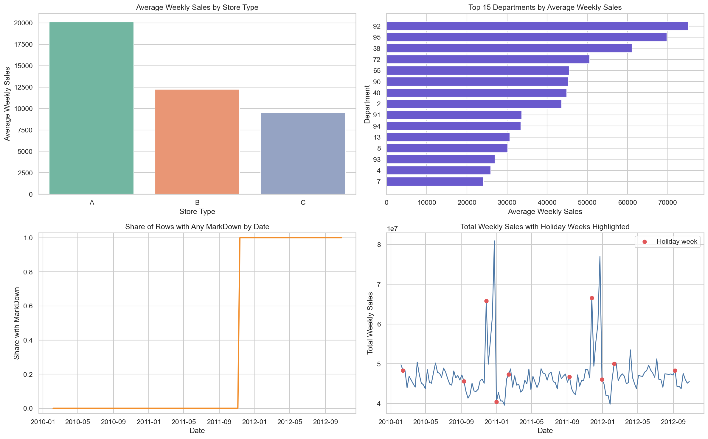
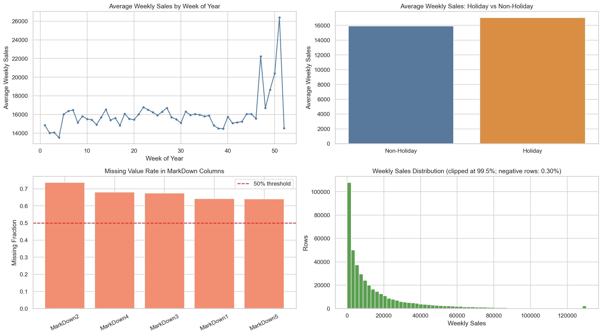
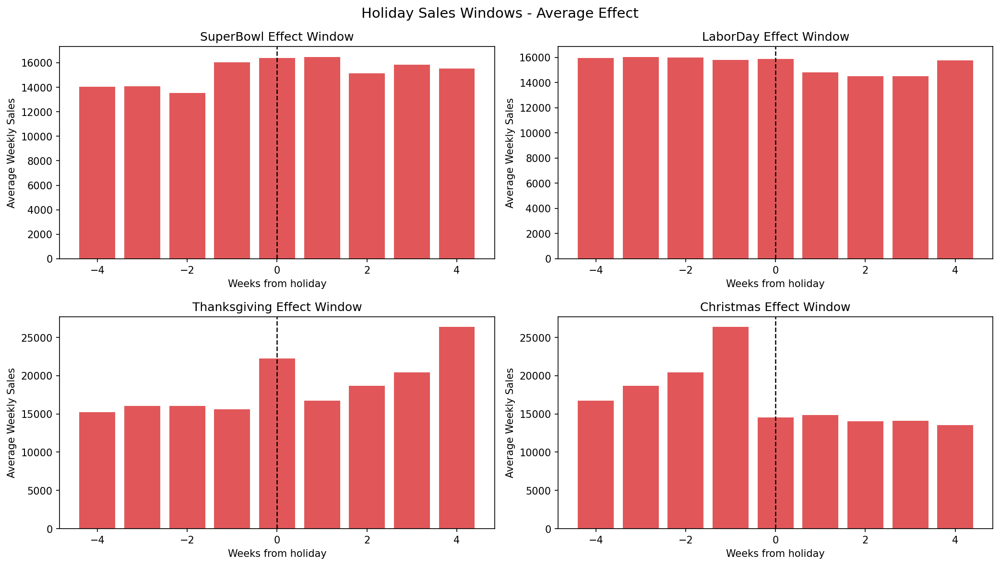
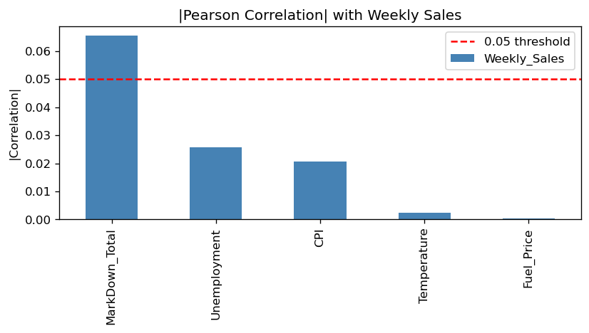
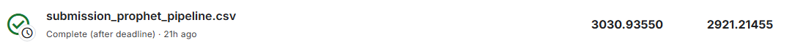

# Walmart Recruiting - Store Sales Forecasting

## კონკურსის მიმოხილვა

Kaggle Walmart Recruiting - Store Sales Forecasting კონკურსის მიზანია Walmart-ის მაღაზიებისა და დეპარტამენტების ყოველკვირეული გაყიდვების პროგნოზირება. 

მოდელმა უნდა იწინასწარმეტყველოს მომავალი 39 კვირის `Weekly_Sales` მნიშვნელობები. პროგნოზირებისათვის ხელმისაწვდომია როგორც ისტორიული გაყიდვები, ასევე დამატებითი ინფორმაცია მაღაზიების ტიპის, ზომის, ეკონომიკური მაჩვენებლებისა და Markdown ფასდაკლებების შესახებ.

მოდელების შეფასება ხდება Weighted Mean Absolute Error-ით (WMAE). ჩვეულებრივ კვირებს ენიჭება წონა 1, ხოლო სადღესასწაულო კვირებს, მაგალითად Thanksgiving-სა და Christmas-ს, ენიჭება წონა 5.

მოდელი განსაკუთრებით კარგად უნდა პროგნოზირებდეს სეზონურ და სადღესასწაულო პერიოდებს. მხოლოდ საშუალო გაყიდვების ზუსტად პროგნოზირება საკმარისი არ არის, რადგან holiday weeks-ის შეცდომა საბოლოო score-ზე ხუთჯერ უფრო ძლიერ მოქმედებს.

პროექტში ერთმანეთს ვადარებთ რამდენიმე განსხვავებული არქიტექტურის მოდელს. თითოეული მოდელისთვის ვამოწმებთ feature engineering-ის მიდგომას, time-series validation-ს, hyperparameter tuning-სა და საბოლოო Kaggle შედეგს.

## რეპოზიტორიის სტრუქტურა

```text
.
|-- src/
|   |-- features.py
|   |-- cv_split.py
|   `-- wmae.py
|-- experiments/
|   |-- model_experiment_CatBoost.ipynb
|   |-- model_experiment_DLinear.ipynb
|   |-- model_experiment_Prophet.ipynb
|   |-- model_experiment_TimeXer.ipynb
|   `-- model_inference.ipynb
|-- readmes/
|   |-- CatBoost_README.md
|   |-- DLinear_README.md
|   |-- Prophet_README.md
|   `-- TimeXer_README.md
`-- README.md
```

`src/features.py` შეიცავს საერთო cleaning და feature engineering ლოგიკას, `src/cv_split.py` - time-based split-ებს, ხოლო `src/wmae.py` - კონკურსის ოფიციალურ მეტრიკას.

`src/features.py` გამოვიყენეთ მონაცემების გასაწმენდად, train/test მონაცემების გასაერთიანებლად და საერთო feature engineering-ის შესასრულებლად. აქ დავამატეთ კალენდარული, სადღესასწაულო, Markdown, მაღაზიისა და გაყიდვების ისტორიულ მონაცემებზე დაფუძნებული ნიშნები. განსაკუთრებით მნიშვნელოვანია origin-style features, რომლებიც გვიცავს data leakage-ისგან და უზრუნველყოფს, რომ validation და test ერთნაირი ლოგიკით დამუშავდეს.

`src/cv_split.py` გამოვიყენეთ time-series მონაცემების ქრონოლოგიურად დასაყოფად. random split-ის ნაცვლად training მონაცემები ყოველთვის წინ უსწრებს validation პერიოდს, რაც რეალურ პროგნოზირების პროცესს შეესაბამება.

`src/wmae.py` გამოვიყენეთ Walmart-ის ოფიციალური შეფასების მეტრიკის დასათვლელად. სადღესასწაულო კვირებს ენიჭება 5-ჯერ მეტი წონა, ამიტომ მოდელების შედარება ხდება როგორც საერთო WMAE-ით, ასევე holiday და non-holiday პერიოდების შეცდომების მიხედვით.

# Prophet

## რატომ ავირჩიეთ Prophet

Prophet არის time-series მოდელი, რომელიც პროგნოზს რამდენიმე კომპონენტად აწყობს: გრძელვადიანი trend, სეზონურობა, დღესასწაულების გავლენა და საჭიროების შემთხვევაში დამატებითი რეგრესორები.

Prophet ავირჩიეთ იმიტომ, რომ Walmart-ის მონაცემებში მკაფიოდ ჩანს წლიური სეზონურობა და დღესასწაულებთან დაკავშირებული გაყიდვების ცვლილებები. CatBoost-ისგან განსხვავებით, Prophet პირდაპირ დროით სერიას სწავლობს და არ მოითხოვს გაყიდვების lag feature-ების შექმნას. მოდელს თავად აქვს ჩაშენებული yearly seasonality და holiday calendar-ის გამოყენების შესაძლებლობა.

ამ ექსპერიმენტში თითოეული `Store-Dept` წყვილისთვის ცალკე Prophet მოდელი ავაშენეთ. ეს საჭიროა იმიტომ, რომ სხვადასხვა მაღაზიასა და დეპარტამენტს განსხვავებული გაყიდვების დონე, trend და სეზონური ქცევა აქვს. ერთი საერთო მოდელის ნაცვლად თითოეულ სერიას საკუთარი ისტორიის მიხედვით ვასწავლით.

Prophet-ის უპირატესობაა მისი ინტერპრეტირებადობა: შესაძლებელია ცალკე დავაკვირდეთ trend-ს, წლიურ სეზონურობას, holiday effect-სა და დამატებითი რეგრესორის გავლენას. თუმცა თითოეული სერიისთვის ცალკე მოდელის გაწვრთნა ძვირია და იშვიათი, მაღალი holiday spike-ების ზუსტად დაჭერა მაინც რთული აღმოჩნდა.

## EDA

Prophet-ისთვის გამოვიყენეთ იგივე EDA, რაც CatBoost-ისა და DLinear-ისთვის, რადგან მონაცემთა ძირითადი კანონზომიერებები ყველა მოდელისთვის მნიშვნელოვანია.



EDA-მ გვაჩვენა ოთხი მნიშვნელოვანი კანონზომიერება:

1. `Type A` მაღაზიების საშუალო გაყიდვები მნიშვნელოვნად აღემატება `Type B` და `Type C` მაღაზიებს.
2. დეპარტამენტებს შორის გაყიდვების მასშტაბი მკვეთრად განსხვავდება.
3. MarkDown მონაცემები მხოლოდ 2011 წლის ნოემბრიდან ჩნდება და მანამდე თითქმის მთლიანად missing-ია.
4. წლის ბოლოს, განსაკუთრებით Thanksgiving/Christmas-ის გარშემო, total sales მკვეთრად იზრდება.



Prophet-ისთვის განსაკუთრებით მნიშვნელოვანი აღმოჩნდა holiday windows-ის ცალკე შემოწმება. ამ გრაფიკზე ვნახეთ, რომ Thanksgiving-ისა და Christmas-ის გარშემო გაყიდვები მხოლოდ დღესასწაულის კვირაში არ იცვლება; ცვლილება რამდენიმე კვირით ადრე ან შემდეგაც გრძელდება.



ამ დაკვირვების საფუძველზე Prophet-ს მივაწოდეთ holiday calendar, სადაც თითოეულ დღესასწაულს თავისი წინასა და შემდგომი კვირების ფანჯარა აქვს.

### როგორ გამოვიყენეთ EDA

| EDA დაკვირვება | Prophet-ის გადაწყვეტილება |
|---|---|
| წლის განმავლობაში არსებობს განმეორებადი სეზონური pattern | Prophet-ში ჩავრთეთ `yearly_seasonality=True` |
| Thanksgiving-ისა და Christmas-ის გავლენა რამდენიმე კვირაზე ვრცელდება | შევქმენით holiday DataFrame `lower_window` და `upper_window` მნიშვნელობებით |
| Holiday შეცდომა 5-ჯერ ძვირია | შეფასებისას გამოვიყენეთ WMAE და ცალკე შევინახეთ holiday/non-holiday MAE |
| MarkDown მონაცემები დიდი რაოდენობით missing-ია | missing მნიშვნელობები შევავსეთ 0-ით და შევქმენით `MarkDown_Total` |
| ეკონომიკური ცვლადების პირდაპირი კავშირი target-თან დაბალია | regressors ჯერ კორელაციით შევარჩიეთ, შემდეგ tuning-ში მათი გამოყენება ცალკე შევადარეთ |

## მონაცემების გაწმენდა

`Prophet_Cleaning` ეტაპზე შესრულდა:

- `Date` გარდაიქმნა Prophet-ისთვის საჭირო `ds` ფორმატში;
- უარყოფითი `Weekly_Sales` მნიშვნელობები 0-ზე ქვემოთ შეიზღუდა;
- `MarkDown1`-`MarkDown5` missing მნიშვნელობები შეივსო 0-ით და უარყოფითი markdown-ები 0-ზე შეიზღუდა;
- ხუთივე Markdown სვეტის ჯამიდან შეიქმნა `MarkDown_Total`;
- `CPI`, `Unemployment`, `Temperature` და `Fuel_Price` შეივსო კონკრეტული მაღაზიის ფარგლებში forward-fill და backward-fill მეთოდებით;
- გამოყენებისთვის დარჩა ის Store-Dept სერიები, რომლებსაც მინიმუმ 26 კვირის ისტორია ჰქონდათ.

Prophet-ის შემთხვევაში უარყოფითი target-ები 0-ზე შევზღუდეთ, რადგან საბოლოო forecast-ს უარყოფითი გაყიდვები არ უნდა ჰქონდეს და მოდელი თითოეული სერიის დონეზე პირდაპირ raw sales scale-ზე მუშაობს.

## Feature Engineering და Regressors

Prophet-ის ძირითადი დროითი სიგნალი თვითონ მოდელის კომპონენტებიდან მოდის. ჩვენ არ გამოვიყენეთ CatBoost-ის short lag-ები ან DLinear-ის 52-კვირიანი input window. Prophet-ს მივაწოდეთ თარიღი, target და დამატებითი რეგრესორები.


რეგრესორებად განვიხილეთ:

```text
Temperature
Fuel_Price
CPI
Unemployment
MarkDown_Total
```

პირველ ეტაპზე გამოვთვალეთ თითოეული რეგრესორის აბსოლუტური Pearson correlation `Weekly_Sales`-თან. 0.05 threshold-ის გამოყენებით correlation chart-ზე მხოლოდ `MarkDown_Total` გადავიდა შერჩეულ regressors-ში.



გრაფიკიდან ჩანს, რომ `MarkDown_Total`-ის აბსოლუტური correlation დაახლოებით 0.065 იყო და 0.05 threshold-ს აჭარბებდა. `Unemployment` და `CPI` შედარებით დაბალი იყო, ხოლო `Temperature` და `Fuel_Price` თითქმის არ აჩვენებდა პირდაპირ კავშირს target-თან.

თუმცა correlation მხოლოდ საწყისი ფილტრი იყო და არა საბოლოო გადაწყვეტილება. tuning-ის დროს შევადარეთ სამი ვარიანტი:

- regressors-ის გარეშე;
- `MarkDown_Total`-ით;
- correlation-ით შერჩეული რეგრესორით.

ამ შედარებამ გვაჩვენა, რომ feature selection-ით შერჩეული `MarkDown_Total` საბოლოოდ საუკეთესო არ აღმოჩნდა. საბოლოო გამარჯვებულმა Prophet-მა რეგრესორები საერთოდ არ გამოიყენა, რადგან ჩაშენებულმა yearly seasonality-მ ამ validation setup-ზე უკეთესი შედეგი აჩვენა.

## Prophet-ის არქიტექტურა

თითოეული Store-Dept სერიისთვის Prophet პროგნოზს შემდეგი კომპონენტებისგან აწყობს:

```text
Weekly_Sales forecast
    = trend
    + yearly seasonality
    + holiday effects
    + optional regressors
```

ჩვენს მოდელში:

- `yearly_seasonality=True` გამოვიყენეთ, რადგან მონაცემებში 52-კვირიანი განმეორებადი pattern ჩანს;
- `weekly_seasonality=False` გამოვიყენეთ, რადგან თითოეული row უკვე კვირის მონაცემია და შიდა კვირის დღეების სეზონურობა არ გვაქვს;
- `daily_seasonality=False` გამოვიყენეთ, რადგან მონაცემები ყოველდღიური არაა;
- Super Bowl-ისა და Labor Day-ისთვის გამოვიყენეთ ერთი კვირით ადრე და ერთი კვირით შემდეგი ფანჯარა;
- Thanksgiving-ისთვის გამოვიყენეთ ერთი კვირით ადრე და ორი კვირით შემდეგი ფანჯარა;
- Christmas-ისთვის გამოვიყენეთ ორი კვირით ადრე და ერთი კვირით შემდეგი ფანჯარა.

### ძირითადი Prophet პარამეტრები

`changepoint_prior_scale` განსაზღვრავს, რამდენად თავისუფლად შეუძლია მოდელს trend-ის ცვლილებებზე მორგება. დაბალი მნიშვნელობა trend-ს უფრო გლუვს ტოვებს, მაღალი მნიშვნელობა კი უფრო მეტ ცვლილებას უშვებს.

`seasonality_prior_scale` აკონტროლებს, რამდენად ძლიერად შეუძლია მოდელს სეზონურობის გამოყენება. ძალიან დაბალმა მნიშვნელობამ შეიძლება seasonal pattern ზედმეტად შეასუსტოს, ხოლო ძალიან მაღალმა მნიშვნელობამ შეიძლება noise-საც მოარგოს.

## Validation სტრატეგია

Prophet-ის validation-ში გამოვიყენეთ კონკურსის test-ის შესაბამისი სრული 39-კვირიანი ჰორიზონტი:

```text
Training history: 2010-02-05 - 2012-01-27
Validation:       2012-02-03 - 2012-10-26
```

თითოეული Store-Dept წყვილისთვის Prophet-ის მოდელი გაიწვრთნა მხოლოდ validation-ის დაწყებამდე არსებული მონაცემებით. შემდეგ იმავე სერიისთვის შეიქმნა მომავალი validation dates და შეფასდა WMAE-ით.

ეს მიდგომა გამორიცხავს მომავალი validation sales-ის feature-ებად გამოყენებას. Prophet იყენებს მხოლოდ ისტორიულ `y`-ს და validation პერიოდისთვის წინასწარ ცნობილ თარიღებს, holiday calendar-სა და არჩეულ regressors-ს.

ყველა Store-Dept სერია პარალელურად დამუშავდა, რათა ასობით ცალკე Prophet მოდელის training დრო შემცირებულიყო. შედეგებში ცალკე ვინახავდით საერთო WMAE-ს, holiday MAE-სა და non-holiday MAE-ს.

## Hyperparameter Tuning

Prophet-ის tuning-ში შევადარეთ:

- `changepoint_prior_scale`: 0.01, 0.05 და 0.1;
- `seasonality_prior_scale`: 1.0 და 10.0;
- regressors-ის სამი ვარიანტი.

სულ მივიღეთ 12 trial. თითოეული trial-ისთვის ცალკე Prophet მოდელები გაიწვრთნა ყველა validation Store-Dept სერიაზე და შედეგი WMAE-ით შეფასდა.

| Trial | Changepoint prior | Seasonality prior | Regressors | Validation WMAE |
|---:|---:|---:|---|---:|
| 5 | 0.05 | 1.0 | none | **1,732.32** |
| 6 | 0.05 | 1.0 | `MarkDown_Total` | 1,768.41 |
| 7 | 0.05 | 10.0 | none | 1,778.09 |
| 9 | 0.10 | 1.0 | none | 1,789.19 |
| 10 | 0.10 | 1.0 | `MarkDown_Total` | 1,798.35 |
| 2 | 0.01 | 1.0 | `MarkDown_Total` | 1,817.03 |
| 8 | 0.05 | 10.0 | `MarkDown_Total` | 1,819.99 |
| 1 | 0.01 | 1.0 | none | 1,822.54 |
| 11 | 0.10 | 10.0 | none | 1,833.27 |
| 3 | 0.01 | 10.0 | none | 1,853.64 |
| 12 | 0.10 | 10.0 | `MarkDown_Total` | 1,860.24 |
| 4 | 0.01 | 10.0 | `MarkDown_Total` | 1,892.89 |

საუკეთესო configuration იყო:

```text
changepoint_prior_scale = 0.05
seasonality_prior_scale = 1.0
regressors = none
validation WMAE = 1,732.32
```

ეს შედეგი საინტერესოა, რადგან Pearson correlation-მა `MarkDown_Total` შეარჩია, მაგრამ tuning-ში regressors-ის გარეშე Prophet-მა უკეთესი შედეგი აჩვენა. ამიტომ საბოლოო feature selection მხოლოდ correlation-ზე არ დაგვიფუძნებია.

## მთავარი სირთულეები და გამოსწორებები

### 1. ბევრი ცალკე დროითი სერია

Walmart-ის მონაცემები ერთი საერთო დროითი სერია არ არის. თითოეულ Store-Dept წყვილს საკუთარი გაყიდვების დონე და ისტორია აქვს. ერთი Prophet მოდელის ყველა მაღაზიაზე გამოყენება სხვადასხვა series-ის განსხვავებულ მასშტაბებს ერთმანეთში აურევდა.

**გამოსწორება:** თითოეული Store-Dept წყვილისთვის ცალკე Prophet მოდელი გავწვრთენით და საბოლოო predictions ისევ შესაბამის Store-Dept-Date row-ებს დავუბრუნეთ.

### 2. Holiday effect მხოლოდ ერთ კვირას არ ეხება

Thanksgiving-ისა და Christmas-ის გაყიდვების ცვლილება ხშირად დღესასწაულამდე იწყება და რამდენიმე კვირის შემდეგაც გრძელდება. მხოლოდ `IsHoliday=True` flag-ი ამ ეფექტს სრულად ვერ აღწერს.

**გამოსწორება:** Prophet-ს მივაწოდეთ holiday calendar `lower_window` და `upper_window` პარამეტრებით. ამით მოდელმა თითოეული დღესასწაულის გარშემო რამდენიმე კვირის ეფექტის სწავლა შეძლო.

## ექსპერიმენტების შედეგები



| ექსპერიმენტი | შედეგი |
|---|---:|
| Prophet საუკეთესო validation configuration | **1,732.32 WMAE** |
| Prophet pipeline, public Kaggle score | **2,921.21455** |
| Prophet pipeline, private Kaggle score | **3,030.93550** |
| საბოლოო changepoint prior | 0.05 |
| საბოლოო seasonality prior | 1.0 |
| საბოლოო regressors | none |

Prophet-მა აჩვენა, რომ ჩაშენებული yearly seasonality და holiday calendar შეიძლება უფრო სასარგებლო იყოს, ვიდრე ეკონომიკური regressors. თუმცა Kaggle-ის საბოლოო შედეგით ის CatBoost-ს ჩამორჩა, რადგან CatBoost-მა Store-Dept-ის სპეციფიკური განსხვავებები და წინა წლის გაყიდვების სიგნალი უკეთ გამოიყენა.

## MLflow სტრუქტურა

Prophet-ის ეტაპები ინახება `Prophet_Training` experiment-ში:

```text
Prophet_Training
|-- Prophet_Cleaning
|-- Prophet_Feature_Selection
|-- Prophet_CV
|-- Prophet_Tuning
|   |-- Prophet_trial_01
|   |-- Prophet_trial_02
|   `-- ...
`-- Prophet_Final
```

ამ notebook-ში ცალკე run-ებად დალოგილია cleaning, feature selection, cross validation, tuning და final model. Tuning-ის თითოეული configuration nested run-ად ინახება.

ლოგებში ინახება:

- cleaning statistics და valid series-ის რაოდენობა;
- correlation values და `prophet_regressor_corr.png` artifact;
- holiday calendar-ის პარამეტრები;
- თითოეული tuning trial-ის prior-ები, regressors და WMAE;
- validation WMAE, holiday MAE და non-holiday MAE;
- საბოლოო `prophet_pipeline.joblib` pipeline;
- Model Registry-ში დარეგისტრირებული `WalmartSales_Prophet` მოდელი.

## საბოლოო Pipeline და Inference

Prophet-ის საბოლოო pipeline-ის კონტრაქტია:

```text
Raw merged Walmart dataframe
        -> Markdown და macro cleaning
        -> თითოეული Store-Dept სერიის მომზადება
        -> Prophet-ის ცალკე მოდელი თითოეულ სერიაზე
        -> yearly seasonality და holiday effects
        -> predictions restored to original row order
```

Pipeline იღებს raw merged test dataframe-ს და თვითონ ასრულებს საჭირო preprocessing-ს. შემდეგ თითოეული Store-Dept წყვილისთვის იყენებს შესაბამის Prophet მოდელს და prediction-ს აბრუნებს იმავე input row order-ში.

თუ რომელიმე სერიისთვის საკმარისი მონაცემი არ არის ან ცალკე Prophet მოდელი ვერ შეიქმნა, wrapper იყენებს ამ სერიის საშუალო გაყიდვებს. ყველა საბოლოო prediction 0-ზე ქვემოთ იზღუდება.

`model_inference.ipynb`-ში Prophet pipeline იტვირთება Model Registry-დან, პირდაპირ ეშვება raw test dataframe-ზე, მოწმდება prediction-ების რაოდენობა და row order, შემდეგ კი `sampleSubmission`-ის `Id`-ებთან merge-ით იქმნება `submission_prophet_pipeline.csv`.

## Prophet-ის მთავარი დასკვნები

1. Prophet განსაკუთრებით მოსახერხებელია მაშინ, როდესაც მონაცემებში მკაფიო trend, yearly seasonality და holiday effects არსებობს.
2. Walmart-ის მონაცემებში თითოეული Store-Dept წყვილი ცალკე სერიად დამუშავება აუცილებელია.
3. Holiday calendar-ის წინასა და შემდგომი კვირების მითითებამ დღესასწაულების გავლენის უკეთ აღწერა გახადა შესაძლებელი.
4. Pearson correlation კარგი საწყისი ფილტრია, მაგრამ საბოლოო feature selection აუცილებლად validation tuning-ით უნდა შემოწმდეს.
5. ამ ექსპერიმენტში `MarkDown_Total` correlation-ით შეირჩა, მაგრამ საუკეთესო Prophet რეგრესორის გარეშე აღმოჩნდა.


