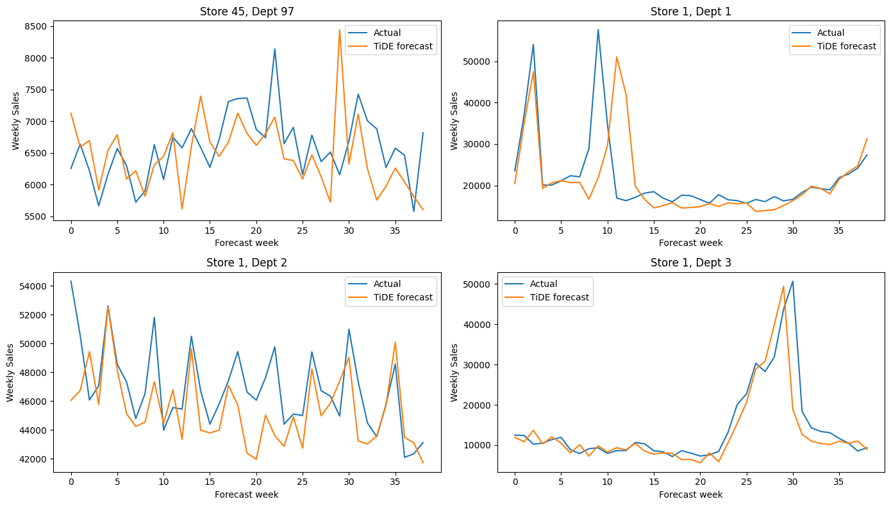

# Walmart Recruiting - Store Sales Forecasting

MLFlow experiments:
(https://dagshub.com/sansi23/Walmart-Recruiting---Store-Sales-Forecasting.mlflow/#/experiments/8/runs?searchFilter=&orderByKey=attributes.start_time&orderByAsc=false&startTime=ALL&lifecycleFilter=Active&modelVersionFilter=All+Runs&datasetsFilter=W10%3D)

`src/features.py` შეიცავს მონაცემების გაერთიანების, cleaning-ისა და საერთო feature engineering-ის ფუნქციებს. `src/wmae.py` შეიცავს კონკურსის ოფიციალურ WMAE მეტრიკას.

TiDE-ის notebook იყენებს `features.py`-დან მხოლოდ იმ ნიშნებს, რომლებიც პროგნოზის მომენტში ხელმისაწვდომია. ჩვეულებრივი lag და rolling feature-ები ცალკე სვეტებად არ იქმნება, რადგან გაყიდვების ისტორია მოდელს პირდაპირ sequence-ის სახით მიეწოდება.

# TiDE

## რატომ  TiDE

**TiDE — Time-series Dense Encoder** არის global deep learning მოდელი, რომელიც დროითი მწკრივის პროგნოზირებისთვის recurrent ან attention ფენების ნაცვლად ძირითადად dense residual ბლოკებს იყენებს.

ჩვენს ამოცანაში თითოეული `(Store, Dept)` წყვილი ცალკე time series-ია. დამოუკიდებელი მოდელის გაწვრთნა 3,000-ზე მეტი სერიისთვის არაეფექტური იქნებოდა, ამიტომ გამოვიყენეთ ერთი global მოდელი, რომელიც ყველა სერიაზე ერთდროულად სწავლობს.

TiDE ავირჩიეთ შემდეგი მიზეზების გამო:

- ერთდროულად პროგნოზირებს სრულ 39-კვირიან horizon-ს;
- იყენებს როგორც წარსულ, ისე წინასწარ ცნობილ მომავალ covariate-ებს;
- Store და Department embedding-ებით სხვადასხვა სერიას შორის ინფორმაციის გაზიარება შეუძლია;
- dense არქიტექტურა Transformer-ზე შედარებით მარტივი და მსუბუქია;
- direct multi-horizon forecast გამორიცხავს recursive prediction-ისას შეცდომების დაგროვებას;
- residual forecast შეიძლება აშენდეს ძლიერ 52-კვირიან seasonal baseline-ზე.

## რატომ TiDE და არა LSTM ან Transformer

LSTM-ის შემთხვევაში 39 კვირის recursive პროგნოზირებამ შეიძლება გამოიწვიოს error accumulation: თითოეული შემდეგი კვირა წინა პროგნოზზე ხდება დამოკიდებული. ჩვენს TiDE მოდელში 39-ივე კვირა ერთ forward pass-ში გამოითვლება.

Transformer და Temporal Fusion Transformer უფრო რთული არქიტექტურებია და დიდ მონაცემებზე ხშირად ძლიერ შედეგს იძლევა, თუმცა მათი tuning და გამოთვლითი ღირებულება უფრო მაღალია. TiDE საშუალებას გვაძლევს გამოვიყენოთ future covariates და global learning შედარებით მარტივი residual MLP არქიტექტურით.

N-BEATS-თან შედარებით TiDE ბუნებრივად აერთიანებს მრავალ dynamic და static covariate-ს. Walmart-ის ამოცანაში ეს მნიშვნელოვანია, რადგან holidays, markdown-ები, CPI, fuel price და unemployment წინასწარ ცნობილ ან დამატებით კონტექსტურ ინფორმაციას იძლევა.

## მონაცემების მოკლე ანალიზი

CatBoost-ისთვის ჩატარებული EDA იგივე მონაცემთა ნაკრებს ეხება და TiDE-ის დიზაინზეც პირდაპირ იმოქმედა.

| დაკვირვება | TiDE-ში მიღებული გადაწყვეტილება |
|---|---|
| გაყიდვებს ძლიერი წლიური სეზონურობა აქვს | მოდელის output დაემატა lag-52 seasonal baseline |
| Thanksgiving და Christmas კვირებზე გაყიდვები მკვეთრად იზრდება | loss-ში holiday კვირებს მიენიჭა წონა 5 |
| Store-Department სერიებს განსხვავებული მასშტაბი აქვთ | target თითოეული სერიის mean/std-ით ცალკე დასკეილდა |
| Store და Dept ერთმანეთისგან მნიშვნელოვნად განსხვავდება | ორივე ცვლადისთვის გამოყენებულია embedding |
| მომავალი calendar და holiday ნიშნები წინასწარ ცნობილია | მოდელს მიეწოდება 39 კვირის `x_future` |
| MarkDown მონაცემებში ბევრი missing მნიშვნელობაა | გამოყენებულია საერთო cleaning და markdown aggregation ფუნქციები |

## მონაცემების მომზადება

მონაცემების დამუშავებისას შესრულდა შემდეგი ნაბიჯები:

- `train.csv`, `test.csv`, `features.csv` და `stores.csv` გაერთიანდა `Store` და `Date` გასაღებებით;
- `Date` გარდაიქმნა datetime ფორმატში;
- მონაცემები დალაგდა `Store`, `Dept`, `Date` მიმდევრობით;
- შეიქმნა calendar, holiday proximity, markdown და store feature-ები;
- macro feature-ების missing მნიშვნელობები შეივსო საერთო feature pipeline-ით;
- გაყიდვების ჩვეულებრივი lag/rolling სვეტები არ შექმნილა, რადგან raw target history მოდელს sequence-ად მიეწოდება.

დამუშავების შემდეგ მიღებული ზომები იყო:

| მონაცემი | ზომა |
|---|---:|
| Train | 421,570 × 33 |
| Test | 115,064 × 32 |
| Store-Department სერიები | 3,331 |

## მოდელის input-ები

თითოეული training sample ერთი Store-Department სერიის forecast origin-ს წარმოადგენს.

| Input | Shape | აღწერა |
|---|---|---|
| `y_past` | `(batch, 52)` | წინა 52 კვირის დასკეილებული გაყიდვები |
| `x_past` | `(batch, 52, 26)` | წინა 52 კვირის dynamic covariate-ები |
| `x_future` | `(batch, 39, 26)` | მომავალი 39 კვირის ცნობილი covariate-ები |
| `store_idx` | `(batch,)` | Store embedding-ის ინდექსი |
| `dept_idx` | `(batch,)` | Department embedding-ის ინდექსი |
| `static` | `(batch, 2)` | `Size` და `Type_Enc` |
| Output | `(batch, 39)` | მომავალი 39 კვირის გაყიდვების პროგნოზი |

## გამოყენებული feature-ები

### Dynamic covariates

```text
Year, Month, WeekOfYear, Quarter,
IsSuperBowl, IsLaborDay, IsThanksgiving, IsChristmas,
WeeksBefore_SuperBowl, WeeksBefore_Thanksgiving, WeeksBefore_Christmas,
WeeksAfter_SuperBowl, WeeksAfter_Thanksgiving, WeeksAfter_Christmas,
MarkDown1, MarkDown2, MarkDown3, MarkDown4, MarkDown5,
MarkDown_Total, MarkDown_Count,
Temperature, Fuel_Price, CPI, Unemployment, IsHoliday
```

### Static features

```text
Size, Type_Enc
```

`Store` და `Dept` static რიცხვით feature-ებად არ გადაცემულა. მათთვის მოდელმა ცალკე embedding-ები ისწავლა.

## TiDE-ის არქიტექტურა

მოდელის ძირითადი pipeline ასეთია:

```text
Past sales sequence (52)
Past dynamic covariates (52 × 26)
Future dynamic covariates (39 × 26)
Store embedding + Dept embedding + static features
                    |
                    v
         Dynamic feature projection
                    |
                    v
     Concatenation into one global vector
                    |
                    v
        Dense residual encoder blocks
                    |
                    v
        Dense residual decoder blocks
                    |
                    v
 Horizon-wise temporal decoder + future covariates
                    |
                    v
       Lag-52 baseline + learned correction
                    |
                    v
          39-week direct forecast
```

### ResidualBlock

თითოეული residual ბლოკი შეიცავს:

1. `Linear` ფენას;
2. `GELU` activation-ს;
3. მეორე `Linear` ფენას;
4. `Dropout`-ს;
5. skip connection-ს;
6. `LayerNorm`-ს.

Skip connection ამარტივებს gradient flow-ს და მოდელს აძლევს შესაძლებლობას, საჭიროების შემთხვევაში input-ის ნაწილი თითქმის უცვლელად გაატაროს.

### Feature projection

26-dimensional dynamic covariate-ები თავდაპირველად გადადის დაბალი განზომილების embedding სივრცეში. ეს ამცირებს encoder input-ის ზომას და მოდელს აიძულებს, დაკავშირებული covariate-ებიდან კომპაქტური representation ისწავლოს.

### Store და Department embedding-ები

Embedding-ები მოდელს აძლევს შესაძლებლობას, ისწავლოს Store-ებისა და Department-ების ფარული მსგავსებები. მაგალითად, სხვადასხვა მაღაზიის მსგავსი დეპარტამენტები შეიძლება გაყიდვების საერთო სეზონურ pattern-ს იზიარებდეს.

### Lag-52 residual baseline

საბოლოო პროგნოზი მიიღება შემდეგი იდეით:

```text
Forecast = Lag-52 seasonal baseline + learned correction
```

52-კვირიანი lookback-ის პირველი 39 მნიშვნელობა თითოეული forecast კვირის წინა წლის შესაბამის კვირას ემთხვევა. ამიტომ მოდელი პროგნოზს ნულიდან არ სწავლობს — საწყისად იღებს ძლიერ annual seasonal baseline-ს და მხოლოდ საჭირო correction-ს ამატებს.

ეს განსაკუთრებით მნიშვნელოვანია Walmart-ის მონაცემებში, სადაც Thanksgiving-ის, Christmas-ისა და სხვა სეზონური პერიოდების გაყიდვები წლიდან წლამდე მსგავს კალენდარულ pattern-ს მიჰყვება.

## მნიშვნელოვანი არქიტექტურული შესწორება: `LayerNorm(1)`

Temporal decoder-ის საბოლოო output ერთ რიცხვს აბრუნებს თითოეული horizon step-ისთვის. ერთგანზომილებიან output-ზე `LayerNorm(1)` პრაქტიკულად ანულირებს ცვალებადობას, რადგან ერთი ელემენტის mean თვითონ ეს ელემენტია და normalized მნიშვნელობა ნულთან მიდის.

ამიტომ საბოლოო scalar head-ში `LayerNorm(1)` არ გამოიყენება. `LayerNorm` რჩება მხოლოდ მრავალგანზომილებიან residual representation-ებზე.

## Leakage-safe scaling

Scaling-ის პარამეტრები მხოლოდ training მხარეს დაითვალა.

- dynamic covariate-ებისთვის გამოიყენება training mean და standard deviation;
- `Size` ასევე მხოლოდ training ნაწილზე დასკეილდა;
- `Weekly_Sales` თითოეული `(Store, Dept)` სერიისთვის ცალკე mean/std-ით დასკეილდა;
- validation პერიოდის target ან covariate statistics scaler-ის fit-ში არ მონაწილეობს.

Per-series target scaling აუცილებელია, რადგან ზოგი დეპარტამენტის გაყიდვები ასეულებშია, ზოგის კი ასიათასებში. ერთი global scaler მცირე სერიებს პრაქტიკულად დაუკარგავდა გავლენას.

## Sliding windows და leakage-ის კონტროლი

ძირითადი validation cutoff იყო **2012-02-03**. ბოლო 39 labeled კვირა validation horizon-ად გამოიყო.

| ნაწილი | შედეგი |
|---|---:|
| Training rows cutoff-მდე | 305,982 |
| Validation rows | 115,588 |
| არჩეული სერიები | 3,306 |
| Training windows | 18,802 |
| Validation windows | 2,700 |
| Origin stride | 2 კვირა |

Training window მხოლოდ მაშინ მიიღება, როდესაც მისი სრული 39-კვირიანი target horizon validation cutoff-მდე მთავრდება. ეს ნიშნავს, რომ არც ერთი training sample validation პერიოდში არ გადადის.

ასევე მოწმდება, რომ 52-კვირიანი history და 39-კვირიანი future horizon უწყვეტი 7-დღიანი ინტერვალებით იყოს წარმოდგენილი. არასრული ან გამოტოვებული weekly sequence training sample-ად არ გამოიყენება.

## რატომ არ გამოვიყენეთ ჩვეულებრივი per-row lag feature-ები

TiDE-ის input-ში უკვე არსებობს სრული `y_past` sequence. ამიტომ `Lag1`, `Lag2`, rolling mean და მსგავსი სვეტების დამატება ზედმეტი იქნებოდა და inference contract-ს გაართულებდა.

განსაკუთრებით სახიფათოა validation frame-ზე ისეთი lag-ის წინასწარ გამოთვლა, რომელიც წინა validation კვირის ნამდვილ `Weekly_Sales` მნიშვნელობას იყენებს. Kaggle-ის 39-კვირიან test horizon-ზე ეს გაყიდვები უცნობია.

TiDE-ის direct-window მიდგომაში მთელი მომავალი horizon ერთდროულად იქმნება მხოლოდ forecast origin-მდე არსებული 52-კვირიანი target history-ით.

## Loss ფუნქცია და შეფასება

Training loss არის holiday-weighted MAE:

```text
weight = 5, თუ კვირა holiday-ა
weight = 1, სხვა შემთხვევაში
```

შეცდომა normalized სივრციდან კვლავ dollar scale-ზე გადადის თითოეული სერიის `target_std`-ის გამოყენებით. ამის შემდეგ ითვლება weighted absolute error.

Loss ბოლოს იყოფა ფიქსირებულ `10,000` მნიშვნელობაზე gradient-ის მასშტაბის დასასტაბილურებლად. ეს ოპტიმუმს არ ცვლის, მხოლოდ training-ს უფრო სტაბილურს ხდის.

მოდელის შერჩევისთვის გამოიყენება ზუსტად პროექტის ოფიციალური `wmae()` ფუნქცია და არა normalized loss.

## Training სტრატეგია

Training-ის დროს გამოყენებულია:

- `AdamW` optimizer;
- `CosineAnnealingLR` scheduler;
- gradient clipping: `max_norm=1.0`;
- early stopping validation WMAE-ის მიხედვით;
- საუკეთესო checkpoint-ის აღდგენა;
- GPU, როდესაც CUDA ხელმისაწვდომია.

Early stopping-ისას ბოლო epoch-ის ნაცვლად ინახება ყველაზე დაბალი validation WMAE-ის მქონე state.

## Hyperparameter tuning

ძვირადღირებული grid search-ის ნაცვლად შევადარეთ სამი მიზნობრივად განსხვავებული არქიტექტურა:

1. **Baseline** — საშუალო ზომის საწყისი მოდელი;
2. **Compact** — ნაკლები hidden dimension, პატარა projection და decoder;
3. **Wide** — უფრო ღრმა და ფართო representation.


### კონფიგურაციების შედარება

| პარამეტრი | Baseline | Compact | Wide |
|---|---:|---:|---:|
| Hidden dimension | 128 | 96 | 256 |
| Encoder layers | 2 | 2 | 3 |
| Decoder layers | 2 | 1 | 2 |
| Feature projection | 8 | 6 | 12 |
| Decoder output dimension | 32 | 24 | 48 |
| Store embedding | 8 | 8 | 12 |
| Dept embedding | 8 | 8 | 12 |
| Dropout | 0.15 | 0.10 | 0.20 |
| Learning rate | 0.001 | 0.0012 | 0.0006 |
| Weight decay | 0.0001 | 0.0001 | 0.0005 |
| მაქსიმალური epochs | 40 | 35 | 45 |
| Patience | 8 | 7 | 9 |

### Validation შედეგები

| მოდელი | საუკეთესო Validation WMAE | საუკეთესო epoch |
|---|---:|---:|
| Baseline | 2,498.57 | საუკეთესო checkpoint early stopping-მდე |
| Compact | **2,321.60** | **1** |
| Wide | 2,527.46 | 1 |

Compact კონფიგურაციამ Baseline გააუმჯობესა დაახლოებით **176.97 WMAE-ით**, ხოლო Wide მოდელზე დაახლოებით **205.86 WMAE-ით** უკეთესი შედეგი აჩვენა.

## რატომ გაიმარჯვა Compact მოდელმა

Wide მოდელის training loss მცირდებოდა, მაგრამ validation WMAE უარესდებოდა. ეს მიუთითებს, რომ უფრო დიდი capacity training windows-ის სპეციფიკურ pattern-ებზე ზედმეტად სწრაფად ერგებოდა.

Compact მოდელმა საუკეთესო validation WMAE უკვე პირველ epoch-ზე მიიღო. შემდეგ training loss-ის შემცირების მიუხედავად validation score გაუარესდა. ამიტომ early stopping-მა პირველი epoch-ის checkpoint აღადგინა.

ეს შედეგი აჩვენებს, რომ ამ setup-ში არქიტექტურის გაზრდა ავტომატურად უკეთეს forecast-ს არ ნიშნავს. ძლიერი lag-52 baseline-ის ფონზე ქსელმა მხოლოდ ზომიერი correction უნდა ისწავლოს; ზედმეტად ფართო decoder შეიძლება სეზონური baseline-იდან არასასურველად გადაიხაროს.

## Forecast ვიზუალიზაცია



გრაფიკებზე ნაჩვენებია ოთხი validation Store-Department სერიის 39-კვირიანი რეალური და TiDE-ის მიერ პროგნოზირებული გაყიდვები. ლურჯი ხაზი რეალურ `Weekly_Sales`-ს ასახავს, ხოლო ნარინჯისფერი — მოდელის forecast-ს.

- **Store 45, Dept 97:** გაყიდვები შედარებით სტაბილურ, დაახლოებით 5,500–8,500 დიაპაზონში მოძრაობს. მოდელი საერთო დონესა და მოკლევადიან რყევებს უმეტესად მიჰყვება, თუმცა 22-ე კვირის რეალურ ზრდას ბოლომდე ვერ იჭერს და 29-ე კვირაზე ზედმეტად მაღალ spike-ს პროგნოზირებს.
- **Store 1, Dept 1:** TiDE სწორად ამოიცნობს სერიის მთავარ სეზონურ ზრდებს, მაგრამ მეორე დიდი პიკი დროით დაახლოებით ორი კვირით გვიან გადააქვს. ეს მაგალითი აჩვენებს, რომ მოდელმა spike-ის მასშტაბი შეიძლება დაახლოებით სწორად შეაფასოს, თუმცა მისი ზუსტი კალენდარული მდებარეობა შეცვალოს.
- **Store 1, Dept 2:** მოდელი კარგად იმეორებს სერიის პერიოდულ ხასიათსა და საერთო გაყიდვების დონეს. მიუხედავად ამისა, რამდენიმე პიკს ამცირებს, ხოლო დაახლოებით 18–22 კვირებში რეალურ მნიშვნელობებზე სისტემატურად დაბალ პროგნოზს იძლევა.
- **Store 1, Dept 3:** მოდელი წარმატებით იჭერს 22-ე კვირიდან დაწყებულ მკვეთრ ზრდას და პიკის მასშტაბსაც თითქმის სწორად პროგნოზირებს. მთავარი განსხვავება პიკის შემდეგ ჩანს: რეალური გაყიდვები სწრაფად ეცემა, TiDE კი შემცირებას უფრო თანდათან პროგნოზირებს.

საერთო სურათში TiDE კარგად სწავლობს გაყიდვების დონეს, წლიურ სეზონურობასა და ფართო trend-ს. ყველაზე დიდი შეცდომები ჩნდება მკვეთრი პიკების ზუსტ დროზე, ერთკვირიან ანომალიებსა და პიკის შემდეგ სწრაფ ცვლილებებზე. WMAE-ის გამო ეს განსაკუთრებით მნიშვნელოვანია holiday კვირებში, რადგან ასეთ პერიოდებში დაშვებული შეცდომა ხუთჯერ მეტი წონით ითვლება.

## მთავარი სირთულეები და გამოსწორებები

### 1. Validation window-ის cutoff-ის გადაკვეთა

თუ training sample-ის input cutoff-მდეა, მაგრამ მისი 39-კვირიანი target horizon validation პერიოდში გადადის, მოდელი validation target-ებზე სწავლობს.

**გამოსწორება:** training window მიიღება მხოლოდ მაშინ, როდესაც მისი ბოლო target კვირაც cutoff-მდეა.

### 2. Scaling leakage

მთელ dataset-ზე scaler-ის fit validation პერიოდის distribution-ს training-ში შეიტანდა.

**გამოსწორება:** covariate, static და target scaler-ები მხოლოდ cutoff-მდე არსებულ მონაცემებზე დაითვალა.

### 3. ერთგანზომილებიან output-ზე `LayerNorm`

`LayerNorm(1)` scalar prediction-ს თითქმის მუდმივ მნიშვნელობად აქცევდა.

**გამოსწორება:** temporal head-ის საბოლოო output-ზე normalization ამოღებულია.

### 4. Holiday spike-ების არასაკმარისი მნიშვნელობა

ჩვეულებრივი MAE მოდელს უბიძგებს, ძირითადად ხშირ non-holiday კვირებზე მოერგოს.

**გამოსწორება:** training loss-ში holiday შეცდომას მიენიჭა წონა 5, ზუსტად Kaggle WMAE-ის მსგავსად.

### 5. სეზონური pattern-ის ნულიდან სწავლა

Dense network-ს annual seasonality-ის სრულად ნულიდან სწავლა გაუჭირდებოდა, განსაკუთრებით იშვიათ holiday spike-ებზე.

**გამოსწორება:** საბოლოო output აგებულია lag-52 baseline-ზე და ქსელი მხოლოდ residual correction-ს სწავლობს.

### 6. უცნობი ან არასრული სერიები inference-ზე

ყველა Store-Department სერიას არ აქვს უწყვეტი ბოლო 52 კვირა. საბოლოო lookback state შეიქმნა **2,755** სერიისთვის.

**გამოსწორება:** თუ სერიას საკმარისი history, scaler ან embedding index არ აქვს, გამოიყენება ამ სერიის median. სრულიად უცნობი სერიისთვის გამოიყენება global median.

### 7. Test row order-ის დარღვევა

GroupBy და sorting ოპერაციებმა prediction-ების საწყისი რიგი შეიძლება შეცვალოს.

**გამოსწორება:** pipeline ინახავს `_row_order` სვეტს და საბოლოო prediction-ებს test dataframe-ის თავდაპირველ რიგში აბრუნებს.

## ექსპერიმენტების შედეგები

| ექსპერიმენტი | შედეგი |
|---|---:|
| TiDE Baseline validation WMAE | 2,498.57 |
| TiDE Compact validation WMAE | **2,321.60** |
| TiDE Wide validation WMAE | 2,527.46 |
| საბოლოო architecture | Compact |
| საბოლოო full-data training windows | 72,600 |
| საბოლოო retraining epochs | 5 |
| Submission rows | 115,064 |

Notebook-ში `submission_tide.csv` წარმატებით გენერირდება, თუმცა Kaggle-ის public/private score ამ ექსპერიმენტის output-ში დაფიქსირებული არ არის. ამიტომ README-ში მხოლოდ რეალურად დალოგილი holdout WMAE არის მითითებული.

## საბოლოო training

საუკეთესო Compact architecture შეირჩა held-out validation WMAE-ის მიხედვით. შემდეგ scaler-ები თავიდან დაითვალა ყველა labeled მონაცემზე და training windows მთელი train history-დან შეიქმნა.

საბოლოო training-ისას მიღებული იყო:

```text
Final training windows: 72,600
Selected architecture: Compact
Training epochs: 5
Registered model: TiDE_WalmartSales
```

ხუთი ეპოქა გამოყენებულია იმიტომ, რომ საუკეთესო validation checkpoint პირველ epoch-ზე იყო, ხოლო საბოლოო retraining კოდში epochs-ის მინიმალური რაოდენობა 5-ად არის განსაზღვრული.

## MLflow სტრუქტურა

MLflow-ში ინახება:

- არქიტექტურის hyperparameter-ები;
- epoch-level training loss;
- epoch-level validation WMAE;
- learning rate;
- საუკეთესო epoch;
- საუკეთესო held-out WMAE;
- `tide_final.pt` model weights;
- PyTorch model artifact;
- `tide_pipeline.pkl` inference pipeline;
- Model Registry ჩანაწერი `TiDE_WalmartSales`.

ექსპერიმენტები ხელმისაწვდომია [DagsHub repository-ში](https://dagshub.com/sansi23/Walmart-Recruiting---Store-Sales-Forecasting).

## საბოლოო Pipeline და Inference

```text
Raw Walmart test.csv
        -> features.csv და stores.csv merge
        -> calendar/holiday/markdown/store features
        -> training-ზე fitted scaling
        -> ბოლო 52 კვირის per-series lookback state
        -> TiDE 39-week direct forecast
        -> per-series/global median fallback
        -> original test row order restoration
        -> submission_tide.csv
```

`TiDEPipeline` არის sklearn-compatible wrapper და raw test dataframe-ს იღებს. Pipeline თვითონ ასრულებს auxiliary table-ებთან merge-ს, feature engineering-ს, scaling-ს და prediction-ს.

საბოლოო artifact-ები:

```text
tide_final.pt
tide_pipeline.pkl
submission_tide.csv
```

`submission_tide.csv` შეიცავს 115,064 row-ს და `Id` იქმნება ფორმატით:

```text
Store_Dept_YYYY-MM-DD
```

## შეზღუდვები

- validation დაფუძნებულია ერთ ბოლო 39-კვირიან holdout-ზე; უფრო სანდო შეფასებისთვის სასურველია რამდენიმე rolling-origin fold;
- 18,802 training window შედარებით მცირე რაოდენობაა 3,306 სერიის global neural model-ისთვის;
- საუკეთესო epoch-ის პირველივე iteration-ზე მიღება მიუთითებს, რომ regularization, learning rate ან validation setup დამატებით შესასწავლია;
- inference history მხოლოდ 2,755 სერიისთვის იყო სრულად ხელმისაწვდომი, ამიტომ დანარჩენებზე median fallback გამოიყენება;
- model artifact pickle serialization-ს იყენებს და მხოლოდ სანდო წყაროდან უნდა ჩაიტვირთოს;
- submission prediction-ები კოდში ქვემოდან ნულზე არ იზღუდება;
- single holdout WMAE პირდაპირ არ უდრის Kaggle public/private score-ს, რადგან პერიოდების holiday mix განსხვავდება.

## შეჯამება
1. Global model საშუალებას გვაძლევს ათასობით Store-Department სერია ერთ არქიტექტურაში გავაერთიანოთ.
2. 39-კვირიანი direct forecast recursive error accumulation-ს თავიდან გვაცილებს.
3. Train და validation scaler-ები მკაცრად უნდა გაიმიჯნოს.
4. Training window-ის სრული target horizon cutoff-მდე უნდა მთავრდებოდეს.
5. Walmart-ის მონაცემებში lag-52 ძლიერი baseline-ია და residual learning-ს მნიშვნელოვნად ამარტივებს.
6. Holiday-weighted loss აუცილებელია, რადგან competition metric holiday შეცდომას ხუთჯერ აძლიერებს.
7. უფრო დიდი neural network ყოველთვის უკეთესი არ არის — Compact მოდელმა Wide architecture-ს აჯობა.
8. Early stopping-ისას საუკეთესო checkpoint-ის აღდგენა აუცილებელია; ბოლო epoch-ის მოდელი ამ ექსპერიმენტში უარესი იქნებოდა.
9. Inference pipeline-მა უნდა შეინარჩუნოს test row order და არასრული სერიებისთვის fallback ჰქონდეს.
10. ერთი holdout-ის გარდა rolling-origin validation მომავალში შეფასებას უფრო სანდოს გახდის.
