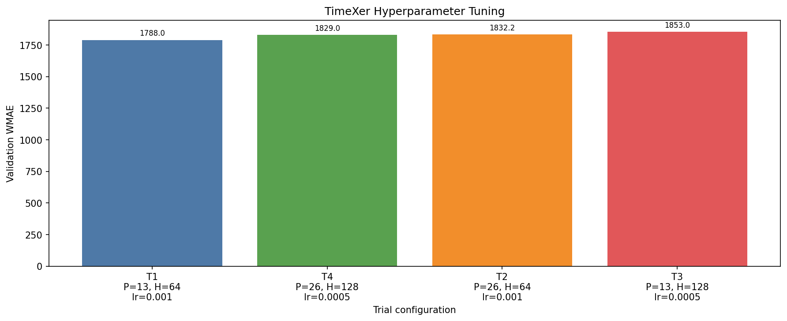

# Walmart Recruiting - Store Sales Forecasting

## კონკურსის მიმოხილვა

Kaggle Walmart Recruiting - Store Sales Forecasting კონკურსის მიზანია Walmart-ის მაღაზიებისა და დეპარტამენტების ყოველკვირეული გაყიდვების პროგნოზირება. 

მოდელმა უნდა იწინასწარმეტყველოს მომავალი 39 კვირის `Weekly_Sales` მნიშვნელობები. პროგნოზირებისათვის ხელმისაწვდომია როგორც ისტორიული გაყიდვები, ასევე დამატებითი ინფორმაცია მაღაზიების ტიპის, ზომის, ეკონომიკური მაჩვენებლებისა და Markdown ფასდაკლებების შესახებ.

მოდელების შეფასება ხდება Weighted Mean Absolute Error-ით (WMAE). ჩვეულებრივ კვირებს ენიჭება წონა 1, ხოლო სადღესასწაულო კვირებს, მაგალითად Thanksgiving-სა და Christmas-ს, ენიჭება წონა 5.

მოდელი განსაკუთრებით კარგად უნდა პროგნოზირებდეს სეზონურ და სადღესასწაულო პერიოდებს. მხოლოდ საშუალო გაყიდვების ზუსტად პროგნოზირება საკმარისი არ არის, რადგან holiday weeks-ის შეცდომა საბოლოო score-ზე ხუთჯერ უფრო ძლიერ მოქმედებს.

პროექტში ერთმანეთს ვადარებთ რამდენიმე განსხვავებული არქიტექტურის მოდელს. თითოეული მოდელისთვის ვამოწმებთ feature engineering-ის მიდგომას, time-series validation-ს, hyperparameter tuning-სა და საბოლოო Kaggle შედეგს.

## რეპოზიტორიის სტრუქტურა

```text
.
|-- src/
|   |-- features.py
|   |-- cv_split.py
|   `-- wmae.py
|-- experiments/
|   |-- model_experiment_CatBoost.ipynb
|   |-- model_experiment_DLinear.ipynb
|   |-- model_experiment_Prophet.ipynb
|   |-- model_experiment_TimeXer.ipynb
|   `-- model_inference.ipynb
|-- readmes/
|   |-- CatBoost_README.md
|   |-- DLinear_README.md
|   |-- Prophet_README.md
|   `-- TimeXer_README.md
`-- README.md
```

`src/features.py` შეიცავს საერთო cleaning და feature engineering ლოგიკას, `src/cv_split.py` - time-based split-ებს, ხოლო `src/wmae.py` - კონკურსის ოფიციალურ მეტრიკას.

`src/features.py` გამოვიყენეთ მონაცემების გასაწმენდად, train/test მონაცემების გასაერთიანებლად და საერთო feature engineering-ის შესასრულებლად. აქ დავამატეთ კალენდარული, სადღესასწაულო, Markdown, მაღაზიისა და გაყიდვების ისტორიულ მონაცემებზე დაფუძნებული ნიშნები. განსაკუთრებით მნიშვნელოვანია origin-style features, რომლებიც გვიცავს data leakage-ისგან და უზრუნველყოფს, რომ validation და test ერთნაირი ლოგიკით დამუშავდეს.

`src/cv_split.py` გამოვიყენეთ time-series მონაცემების ქრონოლოგიურად დასაყოფად. random split-ის ნაცვლად training მონაცემები ყოველთვის წინ უსწრებს validation პერიოდს, რაც რეალურ პროგნოზირების პროცესს შეესაბამება.

`src/wmae.py` გამოვიყენეთ Walmart-ის ოფიციალური შეფასების მეტრიკის დასათვლელად. სადღესასწაულო კვირებს ენიჭება 5-ჯერ მეტი წონა, ამიტომ მოდელების შედარება ხდება როგორც საერთო WMAE-ით, ასევე holiday და non-holiday პერიოდების შეცდომების მიხედვით.

# TimeXer

## რატომ ავირჩიეთ TimeXer

TimeXer არის Transformer-ზე დაფუძნებული თანამედროვე time-series არქიტექტურა, რომელიც სპეციალურად შექმნილია ისეთი ამოცანებისთვის, სადაც მთავარი სერია დამატებით დამატებით ცვლადებთან ერთად პროგნოზირდება. მისი მთავარი იდეაა, რომ ისტორიული გაყიდვები და დამატებითი ცვლადები ერთნაირი გზით არ უნდა დამუშავდეს.

ჩვენს ამოცანაში მთავარი სერიაა `Weekly_Sales`, ხოლო დამატებითი ცვლადებია კალენდარი, დღესასწაულები, Markdown-ები და ეკონომიკური მაჩვენებლები. TimeXer ავირჩიეთ იმის შესამოწმებლად, შეუძლია თუ არა Transformer-ის attention მექანიზმს ერთდროულად ისწავლოს:

- წარსული გაყიდვების დროითი დამოკიდებულებები;
- Store-Dept სერიებს შორის საერთო pattern-ები;
- holiday და Markdown ცვლადების გავლენა გაყიდვებზე;
- მომავალი 39 კვირის გრძელი დამოკიდებულებები.

CatBoost-ისგან განსხვავებით, რომელიც თითოეულ row-ზე ხეების საშუალებით იღებს გადაწყვეტილებას, TimeXer ყველა ვალიდურ Store-Dept სერიაზე გაზიარებულ neural model-ს ავარჯიშებს. Prophet-ისგან განსხვავებით, ის არ ქმნის ცალკე additive მოდელს თითოეული სერიისთვის, არამედ ერთ Transformer-ში სწავლობს საერთო representation-ს.

## TimeXer-ის მთავარი იდეა მარტივი მაგალითით

წარმოვიდგინოთ ერთი Store-Dept სერია, რომლის ბოლო 52 კვირის გაყიდვები მოდელს აქვს:

```text
[100, 110, 105, ..., 180]
```

ამავე 52 კვირისთვის მოდელს აქვს holiday, calendar და Markdown ინფორმაცია. TimeXer შემდეგი 39 კვირის პროგნოზს დაახლოებით ასეთი გზით ქმნის:

```text
52 კვირის sales history
        ↓
პატარა დროით ნაწილებად დაყოფა
        ↓
დროითი token-ების შექმნა
        ↓
Transformer attention
        ↓
დამატებით ცვლადებთან დაკავშირება
        ↓
39 მომავალი კვირის პროგნოზი
```

თუ ისტორიის ბოლო ნაწილში ჩანს, რომ გაყიდვები წლის ბოლოს იზრდება და მომავალი კვირა Christmas-ის პერიოდია, attention მექანიზმს შეუძლია ერთმანეთს დაუკავშიროს ძველი seasonal pattern და მომავალი holiday signal.

## არქიტექტურა დეტალურად

TimeXer-ში ორი ტიპის ინფორმაცია სხვადასხვა გზით იკოდირება:

```text
Endogenous data:  ისტორიული Weekly_Sales
Exogenous data:   calendar, holiday, Markdown, economic features
Static data:      Store, Dept, Type_Enc, Size
```

### 1. გაყიდვების ისტორიის დაყოფა patch-ებად

ჩვენს მოდელში `input_size=52` არის. ეს ნიშნავს, რომ თითოეული პროგნოზისთვის TimeXer ბოლო 52 კვირის ისტორიას უყურებს.

ეს 52 კვირა იყოფა პატარა მონაკვეთებად. საუკეთესო trial-ში `patch_len=13` იყო, ამიტომ:

```text
52 კვირა / 13 კვირა = 4 დროითი patch
```

თითოეული patch გადაიქცევა embedding-ად, ანუ რიცხვით ვექტორად, რომელიც ამ მონაკვეთის ინფორმაციას ინახავს. Patch-ების გამოყენება საშუალებას აძლევს Transformer-ს მთელ 52-კვირიან სერიაზე იმუშაოს უფრო მოკლე, შინაარსიან ერთეულებთან.

`patch_len=26` შემთხვევაში 52 კვირა მხოლოდ ორ დიდ patch-ად იყოფა. ეს ამცირებს token-ების რაოდენობას, მაგრამ შესაძლოა მოკლე seasonal ცვლილებების ნაწილი დაიკარგოს. ჩვენს tuning-ში patch 13 უკეთესი აღმოჩნდა.

### 2. Global token

გაყიდვების patch-ებთან ერთად მოდელს აქვს series-level global token-იც. ის არ წარმოადგენს მხოლოდ ერთ კვირას; მისი მიზანია მთელი სერიის საერთო მდგომარეობის შეჯამება.

ამიტომ model-ს შეუძლია ერთდროულად გამოიყენოს:

- კონკრეტულ patch-ებში არსებული ადგილობრივი ცვლილებები;
- მთელი Store-Dept სერიის საერთო კონტექსტი.

### 3. Self-attention ისტორიულ გაყიდვებზე

Transformer encoder-ის self-attention მექანიზმი ადარებს სხვადასხვა დროით token-ს და სწავლობს, რომელი ისტორიული მონაკვეთი არის მნიშვნელოვანი მომავალი პროგნოზისთვის.

მაგალითად, მას შეუძლია დააკავშიროს:

```text
წინა წლის წლის ბოლოს არსებული pattern
მიმდინარე წლის ბოლო 13 კვირის ცვლილება
მომავალი holiday პერიოდი
```

ეს განსხვავდება უბრალო moving average-ისგან, რადგან attention-ს შეუძლია სხვადასხვა ისტორიულ მონაკვეთს სხვადასხვა მნიშვნელობა მიანიჭოს.

### 4. Exogenous variable token-ები

Exogenous feature-ები არ არის გაყიდვების სერია. ისინი აღწერენ პირობებს, რომლებშიც გაყიდვები წარმოიქმნება. TimeXer მათ ცალკე embedding-ებად ამუშავებს.

ჩვენს მოდელში ეს ინფორმაცია მოიცავს:

- `MarkDown_Total` და `MarkDown_Count`;
- `WeekOfYear`, `Month`, `Quarter` და holiday proximity;
- `IsHoliday`, Thanksgiving, Christmas და სხვა holiday flags;
- `Temperature`, `Fuel_Price`, `CPI` და `Unemployment`.

შემდეგ ტრანსფორმერი ამ exogenous representation-ს ისტორიული sales representation-ს უკავშირებს. ამისათვის გამოიყენება cross-attention ტიპის ურთიერთქმედება: მოდელი სწავლობს, რომელი დამატებითი ცვლადი არის მნიშვნელოვანი კონკრეტული ისტორიული გაყიდვების კონტექსტში.

მაგალითად, `IsHoliday=True` თავისთავად არ ნიშნავს ერთსა და იმავე გაყიდვების ზრდას ყველა დეპარტამენტში. TimeXer-ს შეუძლია ეს signal ისტორიულ sales pattern-თან და კონკრეტულ Store-Dept სერიასთან ერთად შეაფასოს.

### 5. Static series information

`Store`, `Dept`, `Type_Enc` და `Size` მიეწოდება როგორც static exogenous information. ეს მნიშვნელობები დროის განმავლობაში არ იცვლება და ეხმარება მოდელს გაიგოს, რომელი სერია ეკუთვნის რომელ მაღაზიასა და დეპარტამენტს.

ეს განსაკუთრებით მნიშვნელოვანია, რადგან TimeXer ერთი shared model-ია მრავალი სერიისთვის. Static ინფორმაცია ეხმარება ერთიან მოდელს სხვადასხვა Store-Dept სერიებს შორის განსხვავების სწავლაში.

### 6. Encoder და forecast head

ჩვენს საუკეთესო კონფიგურაციაში Transformer encoder-ს ჰქონდა:

```text
hidden_size = 64
n_heads     = 4
e_layers    = 2
d_ff        = 128
dropout     = 0.1
```

Encoder-ის შემდეგ მიღებული representation გადის forecast head-ში, რომელიც პირდაპირ აბრუნებს 39 მომავალი კვირის მნიშვნელობას. ანუ TimeXer არ აკეთებს 39 ცალკე one-step პროგნოზს ის ერთდროულად ქმნის მთელ forecast horizon-ს.

## EDA

TimeXer-ისთვის გამოვიყენეთ იგივე EDA, რაც CatBoost-ის, DLinear-ისა და Prophet-ისთვის, რადგან მონაცემთა საერთო კანონზომიერებები ყველა არქიტექტურისთვის მნიშვნელოვანია.


EDA-მ გვაჩვენა, რომ Store Type-ებსა და დეპარტამენტებს განსხვავებული მასშტაბები აქვთ, MarkDown მონაცემები გვიან ჩნდება, ხოლო Thanksgiving-ისა და Christmas-ის გარშემო გაყიდვები მკვეთრად იცვლება.


TimeXer-ში ეს დაკვირვებები არ გადაგვიქცევია ხელით lag feature-ებად. ისინი მივაწოდეთ როგორც დროითი და exogenous ცვლადები, ხოლო ისტორიული გაყიდვების pattern-ის სწავლა Transformer-ს მივანდეთ.

### როგორ გამოვიყენეთ EDA

| EDA დაკვირვება | TimeXer-ის გადაწყვეტილება |
|---|---|
| Store-Dept სერიებს განსხვავებული მასშტაბები აქვთ | შევქმენით `unique_id` თითოეული Store-Dept წყვილისთვის და static context-ად მივაწოდეთ Store/Dept/Type/Size |
| წლიური სეზონურობა ძლიერია | გამოვიყენეთ 52-კვირიანი `input_size` და Week/Month/Quarter ნიშნები |
| Holiday პერიოდები განსაკუთრებულად მნიშვნელოვანია | selected exogenous features-ში შევინარჩუნეთ holiday flags და holiday proximity |
| Markdown-ის გავლენა ყოველთვის ერთნაირი არ არის | `MarkDown_Total` და `MarkDown_Count` მივაწოდეთ როგორც exogenous ცვლადები |
| სხვადასხვა სერიას შეიძლება საერთო pattern ჰქონდეს | გამოვიყენეთ ერთი global TimeXer model, რომელიც ყველა ვალიდურ სერიაზე ერთად სწავლობს |

## მონაცემების გაწმენდა და სერიების მომზადება

TimeXer-ის notebook-ში მონაცემები გავაერთიანეთ train/test frame-ში და `build_all_features(add_lags=False)`-ით დავამატეთ calendar, holiday, Markdown და macro features. გაყიდვების target უარყოფითი მნიშვნელობები 0-ზე ქვემოთ შეიზღუდა.

შემდეგ:

- თითოეული `Store-Dept` წყვილისგან შეიქმნა `unique_id`;
- თარიღი გადაკეთდა NeuralForecast-ისთვის საჭირო `ds` ფორმატში;
- target-ს ეწოდა `y`;
- თითოეული series დალაგდა ქრონოლოგიურად;
- static მონაცემებად მომზადდა `Store`, `Dept`, `Type_Enc` და `Size`;
- საჭირო იყო მინიმუმ 52 კვირის ისტორია და validation-ისთვის სრული 39 მომავალი კვირა;
- საბოლოოდ დარჩა 2,743 ვალიდური series.

Short target lag-ები არ გამოგვიყენებია. TimeXer-ის endogenous input თვითონ არის ბოლო 52 კვირის sales history, ამიტომ ცალკე `Sales_Lag1`, `Sales_Lag2` და rolling features-ის დამატება საჭირო არ იყო და მომავალში unavailable target-ის გამოყენების რისკს გაზრდიდა.

## Feature Selection

თავდაპირველად გვქონდა 21 შესაძლო future exogenous feature. მათი absolute Pearson correlation `y`-თან გამოვთვალეთ და შევარჩიეთ ის ნიშნები, რომელთა მნიშვნელობა მინიმუმ 0.01 იყო. `IsHoliday` დამატებით შევინარჩუნეთ, თუნდაც correlation threshold-ს ცალკე ვერ გადაეჭარბებინა.

შერჩეული 13 exogenous feature იყო:

```text
MarkDown_Total
WeeksBefore_Christmas
IsThanksgiving
Month
WeekOfYear
Unemployment
CPI
Quarter
MarkDown_Count
WeeksBefore_SuperBowl
IsHoliday
WeeksAfter_Christmas
WeeksAfter_Thanksgiving
```

ეს feature selection მხოლოდ საწყისი შემცირება იყო. მისი მიზანი იყო, რომ TimeXer-ს ყველა სუსტი ეკონომიკური და calendar feature ერთნაირად არ დაემუშავებინა. შემდეგ მათი გავლენა უკვე attention-based მოდელმა ისწავლა.

## Validation სტრატეგია

TimeXer-ის validation-სთვის გამოვიყენეთ სრული 39-კვირიანი მომავალი ჰორიზონტი. მოდელი სწავლობდა origin-მდე არსებულ ისტორიაზე და შემდეგ პროგნოზირებდა მომდევნო 39 კვირას.

შეფასების შედეგი იყო:

```text
CV WMAE:       1,785.06
Holiday MAE:   1,982.30
Non-Holiday:   1,731.76
```

TimeXer-ს ვასწავლიდით GPU-ზე, `MAE` loss-ით და `standard` normalization-ით. WMAE validation-ის საბოლოო metric იყო, ხოლო holiday/non-holiday MAE-ს breakdown-ი გვეხმარებოდა იმის გაგებაში, სად უშვებდა მოდელი უფრო დიდ შეცდომას.

## Hyperparameter Tuning



შევადარეთ ოთხი configuration. ყველა trial-ში `input_size=52`, `h=39`, `n_heads=4`, `e_layers=2`, `d_ff=128` და `dropout=0.1` უცვლელი იყო. იცვლებოდა patch-ის ზომა, hidden representation-ის ზომა და learning rate.

| Trial | Patch length | Hidden size | Learning rate | Validation WMAE | Holiday MAE | Non-Holiday MAE |
|---:|---:|---:|---:|---:|---:|---:|
| 1 | 13 | 64 | 0.0010 | **1,788.04** | 1,981.20 | 1,735.83 |
| 4 | 26 | 128 | 0.0005 | 1,828.96 | 2,021.65 | 1,776.88 |
| 2 | 26 | 64 | 0.0010 | 1,832.21 | 2,060.92 | 1,770.39 |
| 3 | 13 | 128 | 0.0005 | 1,852.99 | 2,215.91 | 1,754.91 |

საუკეთესო configuration იყო:

```text
input_size = 52
patch_len = 13
hidden_size = 64
n_heads = 4
e_layers = 2
d_ff = 128
dropout = 0.1
learning_rate = 0.001
max_steps = 300
```

Patch 13-ის შედეგი უკეთესი აღმოჩნდა, ვიდრე Patch 26-ის. ეს შეიძლება აიხსნას იმით, რომ 13-კვირიანი მონაკვეთები 52-კვირიან ისტორიაში უფრო მეტ დროით დეტალს ინარჩუნებს, ხოლო 26-კვირიანი patch-ები ისტორიას უფრო ძლიერად აჯამებს.

Hidden size 128-მ შედეგი არ გააუმჯობესა. ეს გვაჩვენებს, რომ ამ მონაცემებისთვის უფრო დიდი მოდელი ავტომატურად უკეთესს არ ნიშნავს. ის ზრდის პარამეტრების რაოდენობასა და training-ის სირთულეს, მაგრამ შეიძლება validation period-ის კონკრეტულ pattern-ს ვერ მოერგოს.

## მთავარი სირთულეები და გამოსწორებები

### 1. არასრული დროითი სერიები

TimeXer-ს `input_size=52` სჭირდება. თუ კონკრეტულ Store-Dept წყვილს origin-მდე 52 კვირის ისტორია არ აქვს ან validation-ის შემდეგ სრული 39 კვირა არ რჩება, მისთვის ერთიანი input/output window ვერ შეიქმნება.

**გამოსწორება:** შევინარჩუნეთ მხოლოდ ის series, რომლებსაც მინიმუმ 52 კვირის ისტორია და სრული 39-კვირიანი validation horizon ჰქონდათ. საბოლოო pipeline-ში შემოწმდა, რომ ყველა raw test row-ს prediction დაუბრუნდა.

### 2. მომავალი feature-ებისა და series-ის შესაბამისობა

NeuralForecast-ისთვის ყველა `unique_id`-სა და თარიღს შესაბამისი row უნდა ჰქონდეს. ერთი series-ის ან ერთი მომავალი თარიღის გამოტოვებამ შეიძლება prediction-ის დროს missing combinations error გამოიწვიოს.

**გამოსწორება:** train/test მონაცემები დავალაგეთ `unique_id` და `ds`-ით, static dataframe ცალკე მოვამზადეთ და prediction-ის შემდეგ forecast ისევ თავდაპირველ input order-ს დავუკავშირეთ.

## ექსპერიმენტების შედეგები


| ექსპერიმენტი | შედეგი |
|---|---:|
| TimeXer baseline CV | 1,785.06 WMAE |
| TimeXer საუკეთესო tuning trial | **1,788.04 WMAE** |
| Holiday MAE | 1,981.20 |
| Non-Holiday MAE | 1,735.83 |
| საბოლოო Kaggle submission | **3,223.62387** |

TimeXer-მა აჩვენა, რომ exogenous variables-თან მომუშავე Transformer-ს შეუძლია კარგი local validation შედეგის მიღება. თუმცა CatBoost-ის საბოლოო Kaggle შედეგი უფრო დაბალი WMAE იყო, რაც ამ კონკრეტულ Walmart მონაცემებზე CatBoost-ის უფრო პრაქტიკულ არჩევანად აქცევს.

## MLflow სტრუქტურა

TimeXer-ის ექსპერიმენტები ინახება `TimeXer_Training` experiment-ში:

```text
TimeXer_Training
|-- TimeXer_Feature_Selection
|-- TimeXer_CV
|-- TimeXer_Tuning
|   |-- TimeXer_trial_01
|   |-- TimeXer_trial_02
|   |-- TimeXer_trial_03
|   `-- TimeXer_trial_04
`-- TimeXer_Final
```

ამ notebook-ში ცალკე run-ებად დალოგილია feature selection, cross validation, tuning და final model. თითოეული tuning configuration nested run-ად ინახება.

ლოგებში ინახება:

- candidate და selected exogenous features;
- series count და validation horizon;
- ყველა trial-ის architecture და optimization პარამეტრები;
- overall WMAE, holiday MAE და non-holiday MAE;
- tuning results CSV;
- საბოლოო `WalmartSales_TimeXer` Model Registry-ში.

## საბოლოო Pipeline და Inference

TimeXer-ის საბოლოო pipeline-ის კონტრაქტია:

```text
Raw merged Walmart dataframe
        -> საერთო calendar, holiday, Markdown და macro features
        -> unique_id თითოეული Store-Dept სერიისთვის
        -> NeuralForecast-ის დროითი ფორმატი
        -> TimeXer Transformer
        -> 39-კვირიანი forecast
        -> predictions restored to original row order
```

Pipeline იღებს raw merged test dataframe-ს, ქმნის საჭირო `unique_id` და `ds` სვეტებს, უშვებს დარეგისტრირებულ TimeXer მოდელს და აბრუნებს prediction-ებს საწყის row order-ში. საბოლოო prediction-ები მოწმდება სიგრძეზე, finite მნიშვნელობებზე და უარყოფით მნიშვნელობებზე.

Model Registry-ში დარეგისტრირებული მოდელის სახელია `WalmartSales_TimeXer`. საბოლოო submission შეიქმნა ფაილად `submission_timexer_pipeline.csv`.

## TimeXer-ის მთავარი დასკვნები

1. TimeXer არის Transformer-based მოდელი, რომელიც ისტორიულ target-სა და exogenous ცვლადებს განსხვავებული embedding-ებით აერთიანებს.
2. Patch-ებად დაყოფა ამცირებს გრძელი ისტორიის დამუშავების სირთულეს და ინარჩუნებს დროით მონაკვეთებს.
3. Self-attention სწავლობს ისტორიულ sales patch-ებს შორის დამოკიდებულებებს, ხოლო exogenous interaction ამატებს holiday, Markdown და ეკონომიკურ კონტექსტს.
4. ერთი global model-ის გამოყენება საშუალებას გვაძლევს 2,743 Store-Dept series-ზე საერთო pattern-ები ვისწავლოთ.
5. TimeXer-ის მთავარი trade-off არის მაღალი არქიტექტურული და გარემოს სირთულე: GPU, დიდი მონაცემთა სტრუქტურა და თავსებადი NeuralForecast stack აუცილებელია.


